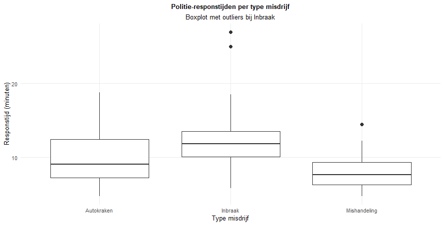

In de onderstaande boxplot zijn aanrijdtijden van politie (in minuten) per type misdrijf (inbraak, mishandeling, autokraken) weergegeven. De box voor ‘Inbraak’ ligt het hoogst en bevat enkele punten buiten de bovenste whisker. Welke uitspraak is correct?

1.	De mediaanresponstijd is het laagst voor inbraak.
2.	De spreiding is het grootst voor autokraken.
3.	Inbraak heeft de hoogste mediaan en bevat outliers.
4.	Mishandeling toont geen variatie in responstijd.

**Hint:** *Een boxplot toont de mediaan (middelste streep), het 1e en 3e kwartiel (randen van de box), en uitschieters (punten voorbij de whiskers). De hoogte van de box geeft de positie van de mediaan aan, terwijl punten buiten de whiskers uitschieters zijn.*

Typ je antwoord als één enkel getal (1-4) om je keuze aan te geven.