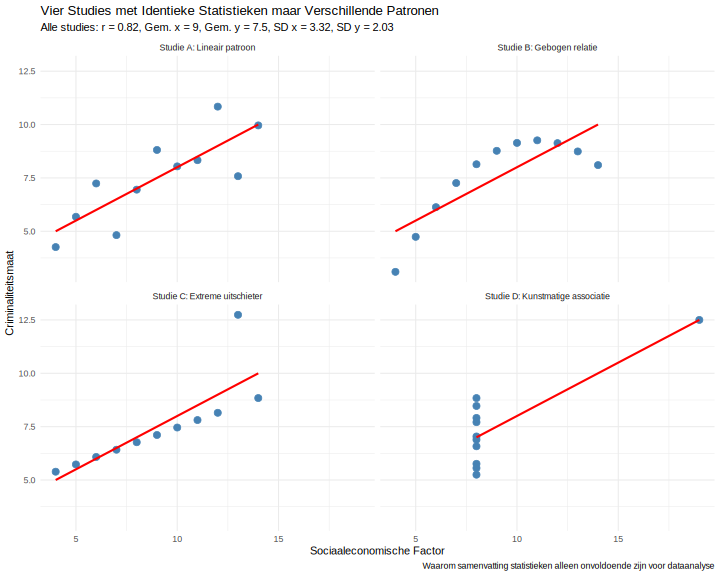

**Een onderzoeker presenteert vier verschillende datasets van criminologische studies over de relatie tussen sociaaleconomische factoren en criminaliteit. Alle vier studies rapporteren precies dezelfde correlatiecoëfficiënt (r = 0,82), hetzelfde gemiddelde, en dezelfde standaarddeviatie. De onderzoeker concludeert dat alle studies identieke resultaten tonen. Wat is de belangrijkste methodologische les uit deze situatie?**

> **Hint:** Wanneer statistieken identiek zijn maar patronen verschillen, wat toont dit aan over de beperkingen van samenvatting getallen?

1. Correlatiecoëfficiënten vertellen het complete verhaal
2. Visuele dataverkenning is essentieel voor betrouwbare analyse
3. Statistische samenvattingen zijn altijd voldoende voor conclusies
4. Studies met identieke correlaties hebben altijd dezelfde interpretatie

Typ je antwoord als één enkel getal (1-4) om je keuze aan te geven.