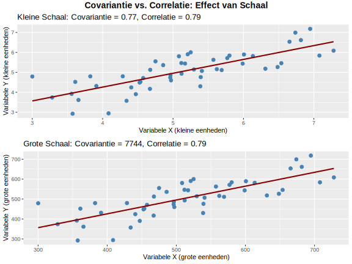

**Welke bewering over covariantie en correlatie is waar?**

> **Hint:** Let op eenheden en bereiken.

1) Beide zijn afhankelijk van meetschaal
2) Covariantie is eenheidsvrij en begrensd tussen −1 en +1
3) Correlatie is eenheidsvrij en altijd tussen −1 en +1
4) Beide zijn onbegrensd

Typ je antwoord als één enkel getal (1-4) om je keuze aan te geven.