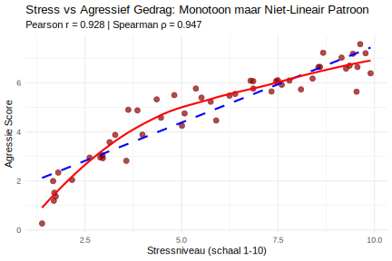

**Een onderzoeker onderzoekt de relatie tussen stress en agressief gedrag bij jongeren. De data toont een gebogen patroon: stress verhoogt agressie aanvankelijk snel, maar bij zeer hoge stressniveaus vlakt de toename af (een verzadigingseffect). Het patroon is monotoon toenemend (altijd omhoog gaand, nooit omlaag) maar niet lineair (geen rechte lijn). Welke correlatiecoëfficiënt moet de onderzoeker gebruiken?**

1. **Beide correlatiecoëfficiënten** zijn even geschikt voor deze situatie
2. **Geen van beide** correlatiecoëfficiënten is geschikt voor deze situatie  
3. **Pearson correlatie** omdat het de **standaard correlatiecoëfficiënt** is
4. **Spearman correlatie** omdat het **monotone relaties** kan meten

Typ je antwoord als één enkel getal (1-4) om je keuze aan te geven.