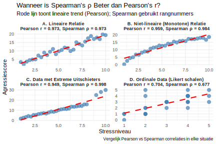

**Een criminoloog heeft verschillende datasets en moet de juiste correlatiecoëfficiënt kiezen. Voor welke situatie zou Spearman's rangcorrelatie (ρ) beter zijn dan Pearson's correlatie (r)?**

> **Hint:** Denk aan wanneer rangnummers beter zijn dan werkelijke waarden.

1) Spearman is altijd beter dan Pearson en zou altijd gebruikt moeten worden
2) Alleen wanneer je minder dan 10 observaties hebt
3) Wanneer er een monotone maar niet-lineaire relatie is, of er extreme uitschieters zijn
4) Wanneer de data een perfecte lineaire relatie toont

Typ je antwoord als één enkel getal (1-4) om je keuze aan te geven.