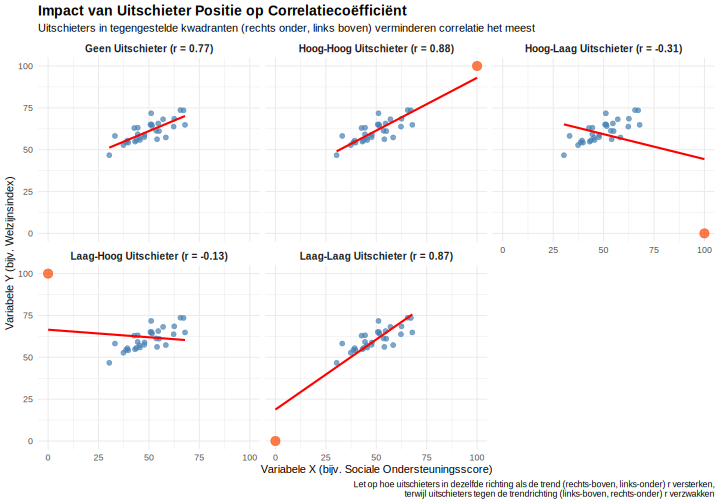

**In een positieve trend, welke uitschieter (extreme waarde die afwijkt van het algemene patroon) positie vermindert r het meest?**

> **Hint:** Denk aan punten die het lineaire patroon doorbreken.

1. Ver **links‑onder** (lage X, zeer lage Y)
2. Ver **rechts‑onder** (hoge X, lage Y)
3. Ver **rechts‑boven** (hoge X, hoge Y)
4. Een punt **precies op de lijn**

Typ je antwoord als één enkel getal (1-4) om je keuze aan te geven.