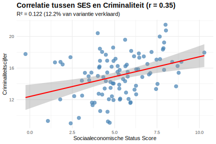

**Een criminoloog rapporteert een correlatie van r = 0,40 tussen sociaaleconomische status en criminaliteitscijfers. Wat is de meest accurate interpretatie van deze correlatie?**

> **Hint:** Denk aan richting, sterkte, en hoeveel variantie wordt verklaard.

1. Een **sterke positieve relatie** waarbij SES **40%** van criminaliteit verklaart
2. Een **matige positieve relatie** waarbij SES en criminaliteit **16% gedeelde variantie** hebben
3. Een **zwakke relatie** die **statistisch niet betekenisvol** is
4. Een **perfecte relatie** die **causaliteit bewijst** tussen SES en criminaliteit

Typ je antwoord als één enkel getal (1-4) om je keuze aan te geven.