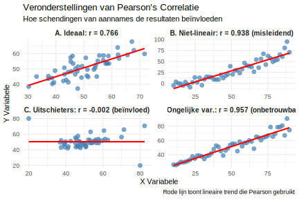

# 3.23 Correlatie - Correlatie aannames

**Welke belangrijkste veronderstellingen (aannames) moet je controleren voordat je Pearson's correlatiecoëfficiënt (r) gebruikt en interpreteert?**

*Begrip 'veronderstellingen': Statistische veronderstellingen zijn voorwaarden die vervuld moeten zijn opdat een statistische methode geldig en betrouwbaar is. Als deze aannames geschonden worden, kunnen de resultaten misleidend of incorrect zijn.*

**Kernconcepten:**
- **Lineariteit**: Relatie moet rechtlijnig zijn (niet gebogen)
- **Continue data**: Interval/ratio meetschaal vereist
- **Normaliteit**: Data benadert normale verdeling
- **Geen uitschieters**: Extreme waarden kunnen correlatie vertekenen
- **Homoscedasticiteit**: Gelijke variantie over alle waarden

> **Hint:** Denk aan wat Pearson correlatie meet (lineaire relaties) en welke data daarvoor geschikt is.

1. Alleen **lineaire relatie** en **continue variabelen** zijn vereist
2. Alleen dat beide variabelen **normaal verdeeld** zijn
3. **Lineariteit**, **continue variabelen**, **normale verdeling**, **geen extreme uitschieters**, en **gelijke variantie**
4. Dat er minstens **30 observaties** zijn en alle waarden **positief** zijn

Typ je antwoord als één enkel getal (1-4) om je keuze aan te geven.