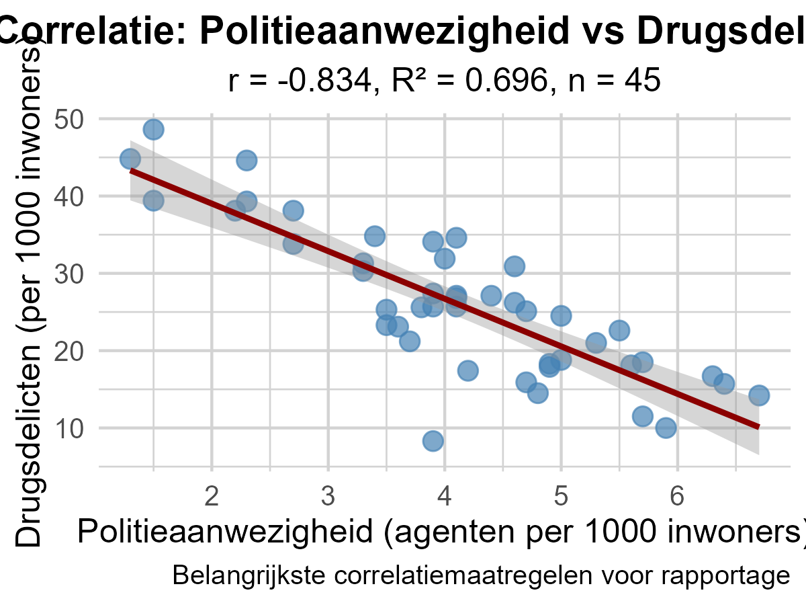

# 3.3 Correlatie - Belangrijkste maatregelen

**Een criminoloog heeft een onderzoek uitgevoerd naar verschillende criminaliteitsvariabelen in 45 Belgische gemeenten. Zij heeft gegevens verzameld over politieaanwezigheid, drugsdelicten, geweldsdelicten en vermogenscriminaliteit. Nu moet zij een correlatiematrix rapporteren zijn de belangrijkste maatregelen in correlatieanalyse?**

> **Hint:** Bij het bestuderen van de relatie tussen twee misdaadgerelateerde variabelen, welke statistieken heb je dan nodig om de associatie volledig te begrijpen en te rapporteren?

    

**=== DESCRIPTIVE STATISTICS ===**

Politieaanwezigheid (agenten per 1000 inwoners):
- Mean (M): 4.12  
- Standard Deviation (SD): 1.3  
- Variance: 1.68

Drugsdelicten (per 1000 inwoners):
- Mean (M): 25.96  
- Standard Deviation (SD): 9.58  
- Variance: 91.86

**=== CORRELATION ANALYSIS ===**

- Correlation coefficient (r): -0.834
- Coefficient of determination (R²): 0.696
- Explained variance: 69.6%
- Sample size (n): 45
- p-value: 0
- Significance: p < .001 ***

1. De **helling** en het **snijpunt**
2. Alleen het **gemiddelde** en de **standaarddeviatie**
3. Alleen de **correlatiecoëfficiënt (r)**
4. **Correlatiecoëfficiënt (r)**, **bepalingscoëfficiënt (R²)** en **steekproefomvang (n)**

Typ je antwoord als één enkel getal (1-4) om je keuze aan te geven.