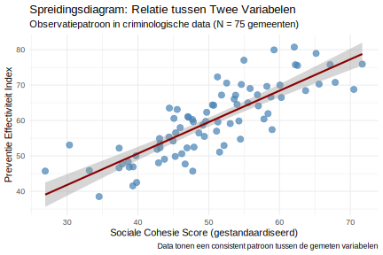

**Een criminoloog onderzoekt de relatie tussen sociale cohesie in buurten (onderlinge verbondenheid en samenwerking tussen bewoners) en de effectiviteit van misdaadpreventie in 75 Belgische gemeenten. Na het verzamelen van data over gemeenschapsbetrokkenheid en lokale veiligheidsprogramma's, berekent ze een correlatie van r = 0,75. Hoe moet zij deze bevinding interpreteren voor haar rapport aan het Ministerie van Justitie en Veiligheid?**

> **Hint:** Overweeg wat een correlatie van r = 0,75 betekent in termen van relatiesterkte, praktische betekenis voor beleid, en hoe dit zou moeten worden gecommuniceerd aan beleidsmakers.

1. **Perfecte negatieve relatie** - tegengesteld effect van verwachting
2. **Sterke positieve relatie** - significante bevinding voor preventiebeleid
3. **Zwakke positieve relatie** - minimale beleidsimplicaties
4. **Geen betekenisvolle relatie** - resultaten zijn statistisch ruis

Typ je antwoord als één enkel getal (1-4) om je keuze aan te geven.