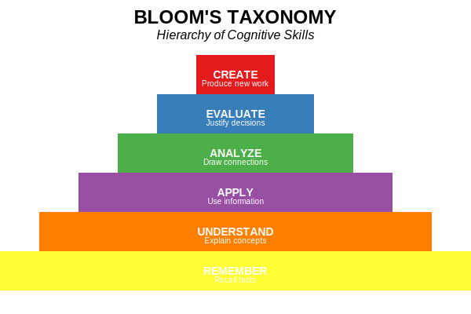

# Dodona Learning Path: Pedagogical & Technical Framework

## 1. Overview of Learning Goals and Student Needs

### Criminology Student Profile
Criminology students typically come from a social science orientation with varying levels of mathematical preparation. They approach statistics primarily as practical tools for understanding crime data rather than as abstract mathematical concepts. Many initially approach statistics with apprehension due to limited prior exposure to formal statistical training. However, when presented through relevant criminological examples, students typically demonstrate stronger engagement and comprehension.

### Purpose of the Learning Path
This learning path supports the development of statistical reasoning skills using crime-relevant examples and contexts. By embedding statistical concepts within criminological scenarios, the learning path aims to:
- Make abstract statistical concepts more concrete and relevant
- Demonstrate the practical utility of statistics in criminological research
- Build confidence through familiar contexts
- Develop critical analytical skills for evidence-based criminology
- Bridge the gap between theory and application
- Reduce statistics anxiety through contextual relevance

## 2. Pedagogical Framework and Course Structure

### Bloom's Taxonomy Integration
The course uses Bloom's Taxonomy (Anderson et al., 2001) to structure a progressive learning journey:

<table align="center">
<tr>
<th style="text-align:right">Cognitive Level</th>
<th style="text-align:center">Questions</th>
<th style="text-align:center">Numbers</th>
<th style="text-align:center">% of Course</th>
</tr>
<tr>
<td style="text-align:right">Remember</td>
<td style="text-align:center">2</td>
<td style="text-align:center">1-2</td>
<td style="text-align:center">13%</td>
</tr>
<tr>
<td style="text-align:right">Understand</td>
<td style="text-align:center">2</td>
<td style="text-align:center">3-4</td>
<td style="text-align:center">13%</td>
</tr>
<tr>
<td style="text-align:right">Apply</td>
<td style="text-align:center">3</td>
<td style="text-align:center">5-7</td>
<td style="text-align:center">20%</td>
</tr>
<tr>
<td style="text-align:right">Analyze</td>
<td style="text-align:center">3</td>
<td style="text-align:center">8-10</td>
<td style="text-align:center">20%</td>
</tr>
<tr>
<td style="text-align:right">Evaluate</td>
<td style="text-align:center">4</td>
<td style="text-align:center">11-14</td>
<td style="text-align:center">27%</td>
</tr>
<tr>
<td style="text-align:right">Create</td>
<td style="text-align:center">1</td>
<td style="text-align:center">15</td>
<td style="text-align:center">7%</td>
</tr>
</table>

This distribution emphasizes higher-order thinking skills (54% at Analyze-Evaluate-Create levels) while building a strong foundation.

### Question-Bloom Level Mapping
The following table shows how each question aligns with specific cognitive levels and learning intentions:

<table align="center">
<tr>
<th style="text-align:right">Question Title</th>
<th style="text-align:center">Bloom Level</th>
<th style="text-align:center">Number</th>
<th style="text-align:center">Learning Intention</th>
</tr>
<tr>
<td style="text-align:right">Level of Measurement</td>
<td style="text-align:center">Remember</td>
<td style="text-align:center">Q1</td>
<td style="text-align:center">Identify and classify data types</td>
</tr>
<tr>
<td style="text-align:right">Descriptive vs. Inferential</td>
<td style="text-align:center">Remember</td>
<td style="text-align:center">Q2</td>
<td style="text-align:center">Differentiate statistical approaches</td>
</tr>
<tr>
<td style="text-align:right">Null Hypothesis</td>
<td style="text-align:center">Understand</td>
<td style="text-align:center">Q3</td>
<td style="text-align:center">Understand hypothesis testing</td>
</tr>
<tr>
<td style="text-align:right">Central Tendency</td>
<td style="text-align:center">Understand</td>
<td style="text-align:center">Q4</td>
<td style="text-align:center">Identify outlier sensitivity</td>
</tr>
<tr>
<td style="text-align:right">Crime Rate Calculation</td>
<td style="text-align:center">Apply</td>
<td style="text-align:center">Q5</td>
<td style="text-align:center">Apply formulas to calculate rates</td>
</tr>
<tr>
<td style="text-align:right">Crime Rates and National Average</td>
<td style="text-align:center">Apply</td>
<td style="text-align:center">Q6</td>
<td style="text-align:center">Compare local to national statistics</td>
</tr>
<tr>
<td style="text-align:right">Sampling Distribution</td>
<td style="text-align:center">Apply</td>
<td style="text-align:center">Q7</td>
<td style="text-align:center">Apply sampling concepts</td>
</tr>
<tr>
<td style="text-align:right">Chi-square</td>
<td style="text-align:center">Analyze</td>
<td style="text-align:center">Q8</td>
<td style="text-align:center">Analyze categorical relationships</td>
</tr>
<tr>
<td style="text-align:right">Histogram Interpretation</td>
<td style="text-align:center">Analyze</td>
<td style="text-align:center">Q9</td>
<td style="text-align:center">Analyze distributions</td>
</tr>
<tr>
<td style="text-align:right">Boxplot Interpretation</td>
<td style="text-align:center">Analyze</td>
<td style="text-align:center">Q10</td>
<td style="text-align:center">Identify outliers and distributions</td>
</tr>
<tr>
<td style="text-align:right">Scatterplot of Unemployment</td>
<td style="text-align:center">Evaluate</td>
<td style="text-align:center">Q11</td>
<td style="text-align:center">Evaluate variable relationships</td>
</tr>
<tr>
<td style="text-align:right">Partial Correlation</td>
<td style="text-align:center">Evaluate</td>
<td style="text-align:center">Q12</td>
<td style="text-align:center">Evaluate complex relationships</td>
</tr>
<tr>
<td style="text-align:right">Significance Test Interpretation</td>
<td style="text-align:center">Evaluate</td>
<td style="text-align:center">Q13</td>
<td style="text-align:center">Evaluate statistical significance</td>
</tr>
<tr>
<td style="text-align:right">Spurious Correlation</td>
<td style="text-align:center">Evaluate</td>
<td style="text-align:center">Q14</td>
<td style="text-align:center">Evaluate causation vs. correlation</td>
</tr>
<tr>
<td style="text-align:right">Research Design Creation</td>
<td style="text-align:center">Create</td>
<td style="text-align:center">Q15</td>
<td style="text-align:center">Design original research methods</td>
</tr>
</table>

## 3. Learning Support Strategies

### Scaffolding Approach
Three key scaffolding techniques support student development:

1. **Question Design**
   - Early exercises provide more guidance; later ones require more independence
   - Content progresses from simple to complex criminological contexts

2. **Multi-level Hint System**
   - Conceptual reminders → Procedural guidance → Worked examples
   - Progressive withdrawal of support through the course

3. **Feedback as a Learning Tool**
   - Precise identification of conceptual errors
   - Metacognitive prompts for reflection
   - Visual explanations for complex concepts

### Anxiety Reduction Features
- **Incremental Difficulty**: Building confidence through early successes
- **Contextualization**: Using crime-related scenarios for relevance
- **Immediate Feedback**: Non-judgmental guidance on errors
- **Multiple Attempts**: Reducing pressure to get it right the first time
- **Clear Expectations**: Explicitly stated learning objectives
- **Visual Supports**: Varied presentation for different learning styles
- **Consistent Structure**: Reduced cognitive load through predictable formats

## 4. Example Content and Feedback

### Example Tips (Dutch)
- "Het gemiddelde is gevoelig voor uitschieters, wat belangrijk is bij het analyseren van misdaadcijfers."
- "Let op: bij een chi-kwadraattoets is de nulhypothese dat er geen verband bestaat tussen de variabelen."
- "Een correlatie van 0,7 tussen werkloosheid en misdaad betekent een sterk verband, maar nog geen causaal verband."
- "Bij het interpreteren van p-waarden, onthoud dat 'niet significant' niet hetzelfde is als 'geen effect'."

### Sample Question Structure
- **Title**: Invloed van Uitschieters op Centrummaten
- **Context**: Inbraakcijfers in 10 wijken in Gent: [5, 7, 6, 8, 5, 9, 6, 7, 40, 7]
- **Scenario**: "Als criminoloog analyseer je inbraakcijfers voor 10 wijken in Gent. Je merkt dat één wijk een opvallend hoog aantal inbraken heeft."
- **Question**: Welke uitspraak is correct over de representativiteit van centrummaten voor deze dataset?
  - A) De mediaan geeft een beter beeld van het "typische" inbraakcijfer omdat deze minder wordt beïnvloed door de uitschieter
  - B) Het gemiddelde geeft een beter beeld van de algemene veiligheidssituatie
  - C) Beide centrummaten zijn even representatief voor deze dataset
  - D) Geen van beide centrummaten is geschikt voor het analyseren van deze data

### Feedback Examples
- **Correct Answer**: "Juist! De mediaan (7) wordt minder beïnvloed door de extreme waarde van 40 in wijk 9. Het gemiddelde (10) wordt sterk omhoog getrokken door deze uitschieter. Bij het rapporteren van 'typische' inbraakcijfers aan beleidsmakers zou de mediaan een accurater beeld geven."
- **Incorrect Answer**: "Niet correct. Het gemiddelde (10) wordt sterk beïnvloed door de uitschieter van 40 inbraken in één wijk. Dit geeft een vertekend beeld van de 'typische' wijk, aangezien 9 van de 10 wijken tussen 5-9 inbraken hebben."

### Hints and Resources
- **Hint Examples**: 
  - "Bereken zowel het gemiddelde als de mediaan en vergelijk de resultaten."
  - "Visualiseer de data met een boxplot om de positie van de uitschieter te zien."
- **External Resources**: Video tutorials, infographics, simulations, glossary of statistical terms, textbook links

## 5. Platform Implementation and Monitoring

### Course Structure in Dodona
The platform organizes content following Bloom's cognitive progression:
1. **Foundation (Questions 1-4)**: Basic concepts of measurement, descriptive statistics, hypothesis testing, and central tendency (Remember & Understand)
2. **Intermediate (Questions 5-10)**: Crime rate calculations, sampling distributions, chi-square tests, histograms, and boxplots (Apply & Analyze)
3. **Advanced (Questions 11-15)**: Relationships between variables, partial correlation, significance testing, spurious correlation, and research design creation (Evaluate & Create)

### Performance Tracking
The Dodona platform provides:
- Comprehensive dashboards for student progress monitoring
- Performance breakdowns by course section
- Identification of conceptual gaps requiring intervention

### Example Exercises
These selected exercises demonstrate the application of Bloom's levels:
- **Descriptive vs. Inferential Statistics**: Foundational differentiation exercise (Remember)
- **Hypothesis Testing with Video**: Multimedia approach to abstract concepts (Understand)
- **Crime Rate Calculation**: Practical application of mathematical operations (Apply)
- **Histogram Interpretation**: Data literacy for population characteristics (Analyze)

## 6. Technical Implementation

### Technical Framework
- **R scripts** for automated answer validation and feedback
- **Markdown** for content presentation
- **JSON configuration** files for exercise parameters

### Accessibility and Integration
- **Language Support**: Dutch content with terminology aligned to student knowledge
- **Visual Alternatives**: Text descriptions for all visual elements
- **Auto-grading**: Automated evaluation with detailed feedback
- **Progress Tracking**: Monitoring of completion rates and performance

### Future Development
Planned enhancements include:
- R Studio integration for complex data analysis
- Advanced multivariate statistical methods
- Adaptive learning pathways based on performance
- Collaborative peer learning exercises

This learning path combines technical accuracy with pedagogical insight to create an inclusive environment where criminology students build confidence through meaningful engagement with statistical concepts.

## 7. References

Anderson, L. W., Krathwohl, D. R., Airasian, P. W., Cruikshank, K. A., Mayer, R. E., Pintrich, P. R., Raths, J., & Wittrock, M. C. (2001). *A taxonomy for learning, teaching, and assessing: A revision of Bloom's Taxonomy of Educational Objectives*. Longman.

Krathwohl, D. R. (2002). A revision of Bloom's taxonomy: An overview. *Theory into Practice*, 41(4), 212-218.
