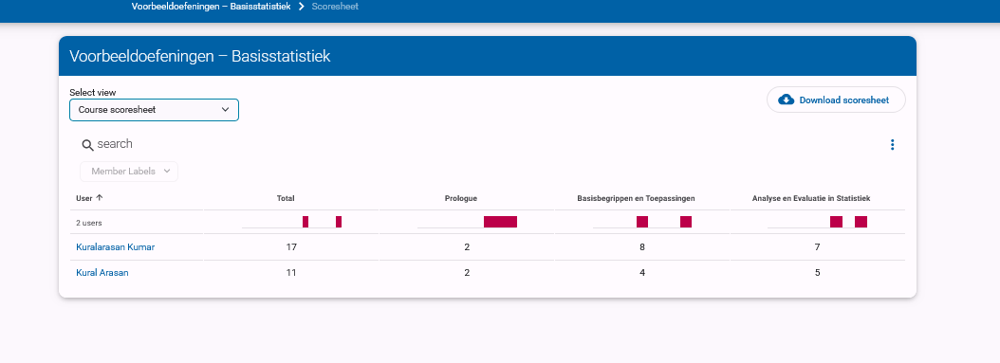
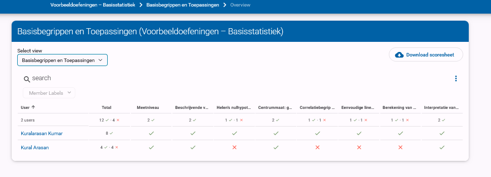
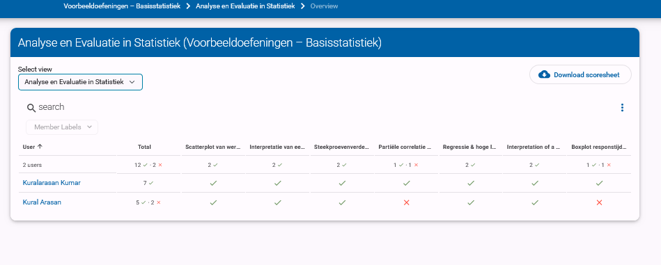
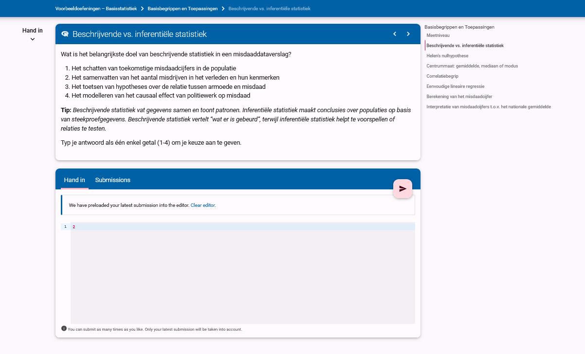
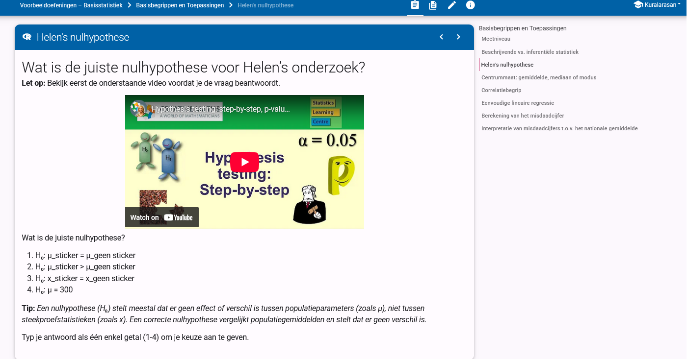
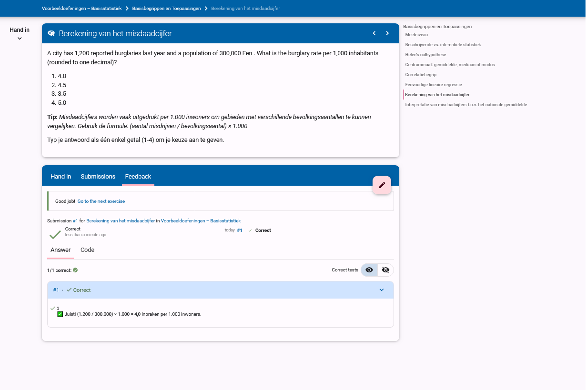
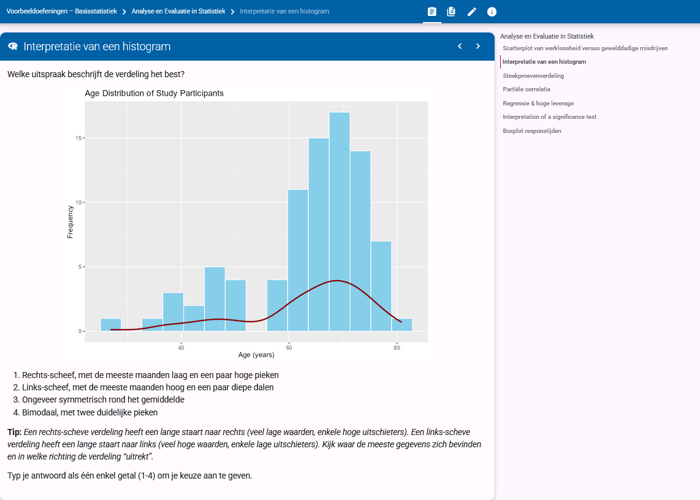
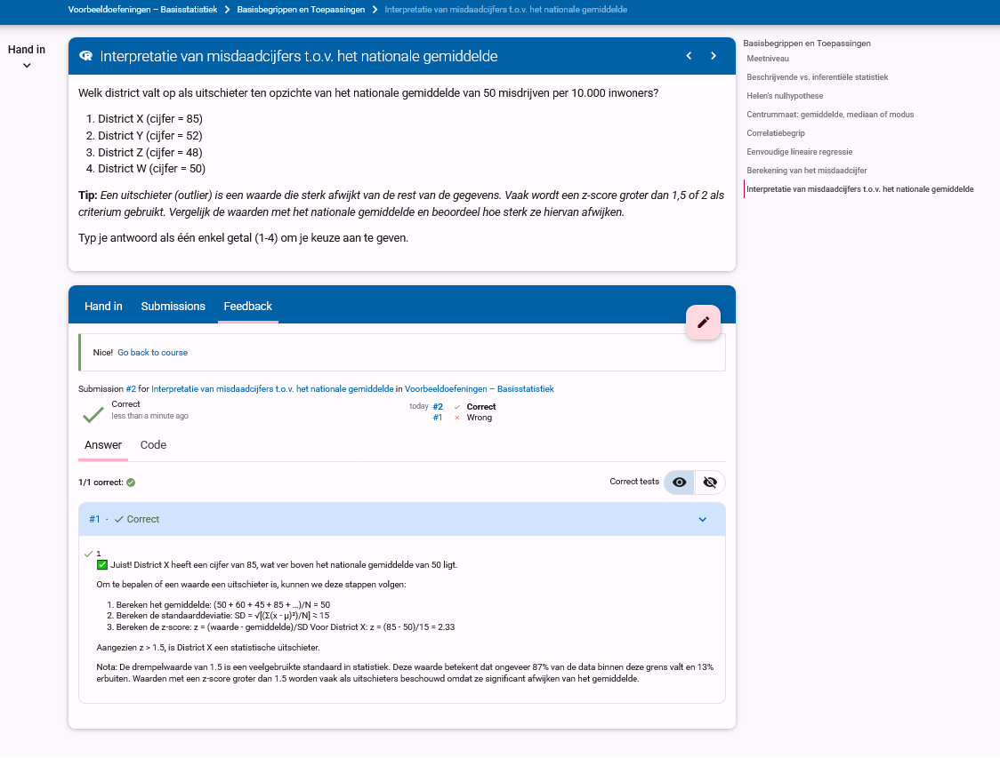
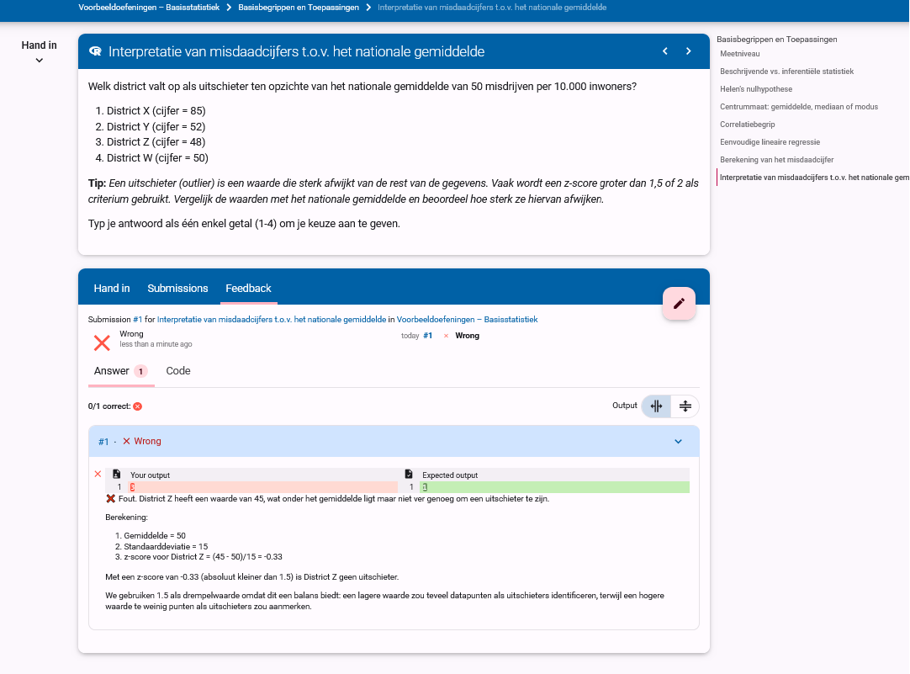

# Dodona Learning Path: Pedagogical & Technical Framework

## Table of Contents
1. [Overview of Learning Goals and Student Needs](#1-overview-of-learning-goals-and-student-needs)
2. [Bloom's Taxonomy Alignment](#2-blooms-taxonomy-alignment)
3. [Learning Design Strategies](#3-learning-design-strategies)
4. [Example Question Elements](#4-example-question-elements)
5. [Annotated Screenshots](#5-annotated-screenshots)
6. [Implementation Details and Technical Considerations](#6-implementation-details-and-technical-considerations)

## 1. Overview of Learning Goals and Student Needs

### Criminology Student Profile
Criminology students typically come from a social science orientation with varying levels of mathematical preparation. They approach statistics primarily as practical tools for understanding crime data and social phenomena rather than as abstract mathematical concepts. These students are generally more interested in the application and interpretation of statistical methods within criminological contexts than in theoretical mathematical foundations. 

Many criminology students initially approach statistics with some apprehension, which can affect their learning experience and confidence in developing quantitative skills. This hesitation often stems from limited prior exposure to formal statistical training or educational experiences that emphasized other forms of analysis. However, when statistical concepts are presented through relevant criminological examples—such as analyzing crime rates, understanding offending patterns, or evaluating intervention programs—students typically demonstrate stronger engagement and comprehension.

### Purpose of the Learning Path
The primary purpose of this learning path is to support the development of statistical reasoning skills using crime-relevant examples and contexts. By embedding statistical concepts within criminological scenarios, the learning path aims to:
- Make abstract statistical concepts more concrete and relevant
- Demonstrate the practical utility of statistics in criminological research and practice
- Build confidence in statistical reasoning through familiar contexts
- Develop critical analytical skills needed for evidence-based criminology
- Bridge the gap between theoretical understanding and practical application
- Support students in overcoming statistics anxiety through contextual relevance

## 2. Bloom's Taxonomy Alignment

### Cognitive Levels
Bloom's Taxonomy provides a hierarchical model of cognitive skills that progresses from lower-order to higher-order thinking skills (Anderson et al., 2001):
1. **Remember**: Recall facts and basic concepts
2. **Understand**: Explain ideas or concepts
3. **Apply**: Use information in new situations
4. **Analyze**: Draw connections among ideas
5. **Evaluate**: Justify a stand or decision
6. **Create**: Produce new or original work

### Question Distribution Across Bloom's Taxonomy

Our course is strategically designed to provide balanced coverage across the cognitive levels:

| Cognitive Level | Number of Questions | Question Numbers | Percentage |
|----------------|---------------------|------------------|------------|
| Remember       | 2                   | 1-2              | 11%        |
| Understand     | 2                   | 3-4              | 11%        |
| Apply          | 4                   | 5-8              | 22%        |
| Analyze        | 3                   | 9-11             | 17%        |
| Evaluate       | 6                   | 12-17            | 33%        |
| Create         | 1                   | 18               | 6%         |

This distribution reflects our emphasis on higher-order thinking skills, with 56% of questions focusing on the top three cognitive levels (Analyze, Evaluate, Create). This approach ensures students develop both foundational knowledge and advanced critical thinking abilities needed for evidence-based criminology.

### Application to Learning Process
The integration of Bloom's Taxonomy into our questions strategically supports criminology students' learning process by:
- **Cognitive Progression**: Building from recall to complex applications, boosting confidence and competence (Krathwohl, 2002)
- **Transfer of Knowledge**: Requiring practical application of concepts in criminological contexts
- **Metacognitive Development**: Encouraging reflection on thinking processes at higher levels
- **Comprehensive Understanding**: Ensuring engagement across all cognitive levels for a holistic grasp
- **Scaffolded Challenges**: Providing appropriate cognitive challenges that build upon prior knowledge (Vygotsky, 1978)
- **Domain-Specific Application**: Applying statistical concepts directly to criminological scenarios

### Course Structure and Bloom's Taxonomy Alignment

The course structure has been organized to progressively build through Bloom's Taxonomy levels:

#### Basic Recall (1-2)
1. **Level of measurement** - Identify and classify different types of data
2. **Descriptive vs. Inferential** - Differentiate between descriptive and inferential statistics

#### Understanding (3-4)
3. **Null hypothesis** - Understand the concept of null hypothesis in statistical testing
4. **Central tendency** - Comprehend measures of central tendency and their applications

#### Application (5-8)
5. **Correlation Concept** - Understand correlation fundamentals and their application
6. **Simple Linear Regression** - Apply regression techniques to analyze relationships
7. **Crime rate calculation** - Apply formulas to calculate crime rates
8. **Crime rates and national average** - Apply comparative analysis of crime statistics

#### Analysis (9-11)
9. **Scatterplot of unemployment** - Analyze relationships between variables
10. **Histogram Interpretation** - Analyze and interpret histogram distributions
11. **Boxplot Interpretation** - Analyze outliers and distributions using boxplots

#### Evaluation (12-17)
12. **Sampling Distribution** - Evaluate sampling concepts and their implications
13. **Partial Correlation** - Evaluate complex relationships between variables
14. **Regression with high leverage** - Evaluate regression diagnostics and influential cases
15. **Interpretation of a significance test** - Evaluate statistical significance in context
16. **Chi-square** - Apply and evaluate chi-square tests for categorical data
17. **Spurious correlation** - Evaluate and critique correlational relationships

#### Creation (18)
18. **Research Design Analysis** - Create and justify research methodologies

### Question-Bloom Level Mapping
| Question Title | Bloom Level | Question Number | Learning Intention | Criminology Context |
|----------------|-------------|-----------------|-------------------|---------------------|
| Level of Measurement | Remember | Q1 | Identify and classify different types of data | Crime statistics classification |
| Descriptive vs. Inferential | Remember | Q2 | Differentiate descriptive from inferential statistics | Police report summaries |
| Null Hypothesis | Understand | Q3 | Understand hypothesis testing foundations | Testing intervention effectiveness |
| Central Tendency | Understand | Q4 | Identify sensitivity to outliers in crime rate data | Crime rates across districts |
| Correlation Concept | Apply | Q5 | Understand correlation fundamentals | Relationship between variables |
| Simple Linear Regression | Apply | Q6 | Apply regression techniques | Predicting crime rates |
| Crime Rate Calculation | Apply | Q7 | Apply formulas to calculate rates | Standardizing crime comparisons |
| Crime Rates and National Average | Apply | Q8 | Compare local to national statistics | Policy effectiveness evaluation |
| Scatterplot of Unemployment | Analyze | Q9 | Analyze relationships between variables | Unemployment and crime rates |
| Histogram Interpretation | Analyze | Q10 | Analyze distributions | Age patterns in offending |
| Boxplot Interpretation | Analyze | Q11 | Identify outliers and distributions | Unusual crime rate patterns |
| Sampling Distribution | Evaluate | Q12 | Evaluate sampling concepts | Population inference |
| Partial Correlation | Evaluate | Q13 | Evaluate complex statistical relationships | Controlling for confounding variables |
| Regression with High Leverage | Evaluate | Q14 | Evaluate regression diagnostics | Identifying influential cases |
| Interpretation of Significance Test | Evaluate | Q15 | Evaluate statistical significance | Program effectiveness assessment |
| Chi-square | Evaluate | Q16 | Apply chi-square to categorical data | Demographic crime pattern analysis |
| Spurious Correlation | Evaluate | Q17 | Critique correlational claims | Distinguishing causation from correlation |
| Research Design Analysis | Create | Q18 | Design original research methods | Creating valid criminological studies |

## 3. Learning Design Strategies

### Course Structure and Bloom's Taxonomy Integration
The course has been carefully restructured to create a clear progression through Bloom's Taxonomy levels, supporting students' cognitive development from foundational knowledge to advanced skills:

1. **Remember & Understand (Questions 1-4)**: Foundational concepts about measurement levels, descriptive statistics, hypothesis testing, and central tendency
2. **Apply (Questions 5-8)**: Practical application of statistical methods including correlation concepts, linear regression, and crime rate calculations
3. **Analyze (Questions 9-11)**: Data interpretation skills through scatterplot, histogram, and boxplot analysis
4. **Evaluate (Questions 12-17)**: Critical assessment of sampling distributions, partial correlations, regression diagnostics, significance testing, chi-square tests, and spurious correlations
5. **Create (Question 18)**: Original research design development and analysis

This organized sequence creates a coherent learning journey through increasing cognitive complexity while maintaining contextual relevance to criminology. The structure deliberately removes overlapping concepts and ensures each level builds upon previous learning.

### Instructional Design Strategy
The learning path is structured using Bloom's Taxonomy as a cognitive scaffold, progressively building from foundational understanding to higher-order skills like evaluation and creation (Krathwohl, 2002).

This layered design includes:
- **Concept Reinforcement**: Building foundational understanding (e.g., mean vs. median, descriptive vs. inferential statistics)
- **Calculation Tasks**: Developing technical skills (e.g., chi-square, regression, effect size calculation)
- **Diagnostic Reasoning**: Encouraging critical analysis (e.g., outlier influence, correlation vs. causality)
- **Design/Decision-making**: Fostering application skills (e.g., choosing appropriate visualizations, constructing survey methodologies)

The sequence of questions deliberately moves students through increasing levels of cognitive complexity while maintaining contextual relevance to criminology.

### Scaffolding Techniques
- **Conceptual Prompts**: Short reminders of key ideas without revealing the answer
- **Strategic Questions**: Sub-questions that guide thinking through complex problems
- **Relevant Examples**: Analogous situations to model thinking in criminological contexts
- **Progressive Disclosure**: Stepwise reveal of complexity to prevent cognitive overload
- **Just-in-Time Resources**: Providing support materials at the moment of need
- **Error-Based Learning**: Using common misconceptions as teaching opportunities

### Scaffolding Implementation in Course Design

The course implements scaffolding principles across multiple dimensions to guide students toward independent statistical reasoning:

#### Question-Level Scaffolding
Each question is designed with embedded scaffolding elements:

1. **Progressive Complexity Within Questions**
   - Early exercises include more guidance and structure
   - Later exercises require more independent problem-solving
   - Example: Crime rate calculation questions begin with formula provided, then advance to requiring students to determine the appropriate approach

2. **Context Familiarity Gradient**
   - Initial questions use simple, familiar criminological contexts
   - Advanced questions introduce more complex, realistic scenarios
   - Example: Moving from simple crime counts in small areas to complex multivariate analyses of national datasets

#### Hint System Design
Hints are strategically designed as scaffolding that can be gradually removed:

1. **Three-Tier Hint Structure**
   - **Level 1**: Conceptual reminders (e.g., "Remember what central tendency measures represent")
   - **Level 2**: Procedural guidance (e.g., "Calculate the median by ordering values and finding the middle point")
   - **Level 3**: Worked examples with similar problems (e.g., "In a similar dataset with outliers, the median was more representative because...")

2. **Fading Support**
   - Early exercises provide immediate access to hints
   - Later exercises introduce time delays before hints become available
   - Advanced exercises limit the number of available hints

#### Feedback as Scaffolding
Feedback is designed not just to indicate correctness but to develop self-regulation skills:

1. **Targeted Error Analysis**
   - Common misconceptions receive specific explanations
   - Feedback identifies the precise reasoning error rather than simply marking an answer wrong
   - Example: "You've calculated the mean correctly, but haven't considered how outliers affect its representativeness"

2. **Metacognitive Prompting**
   - Feedback includes reflective questions
   - Encourages students to evaluate their approach
   - Example: "How would your interpretation change if this dataset had no outliers?"

3. **Instructional Remediation**
   - Links to specific resources based on error patterns
   - Visual explanations for complex concepts
   - Example: Providing a visualization of how chi-square values map to probability distributions when students misinterpret significance

4. **Progressive Independence**
   - Early feedback is detailed and directive
   - Advanced feedback becomes more general and encourages self-diagnosis
   - Final exercises provide minimal guidance, promoting independent statistical thinking

This multi-layered scaffolding approach ensures that support is available when needed but gradually withdrawn as students develop competence, following Vygotsky's concept of the Zone of Proximal Development where learning occurs with appropriate guidance that adapts to student growth.

### Anxiety Reduction Through Structured Design
The exercise design incorporates several features specifically aimed at reducing statistics anxiety:

- **Incremental Difficulty**: Questions gradually increase in complexity, allowing students to build confidence with early successes before tackling harder concepts
- **Contextualization**: Crime-related scenarios make abstract statistical concepts more concrete and relevant to students' career interests
- **Immediate Feedback**: Detailed, non-judgmental feedback helps students understand errors and reinforces correct thinking patterns
- **Multiple Attempts**: Most exercises allow multiple attempts, reducing the pressure of getting it right the first time
- **Clear Expectations**: Learning objectives are explicitly stated, removing uncertainty about what students are expected to know
- **Visual Supports**: Graphs, tables, and visual elements help students with different learning styles understand complex ideas
- **Consistent Structure**: Predictable exercise formats reduce cognitive load, allowing students to focus on content rather than navigating unfamiliar interfaces

These design elements collectively create a more supportive learning environment that acknowledges and addresses the statistical anxiety many criminology students experience.

### Feedback and Support Elements

#### Example Tips (Dutch)
- "Het gemiddelde is gevoelig voor uitschieters, wat belangrijk is bij het analyseren van misdaadcijfers in wijken met occasionele extreme waarden."
- "Let op: bij een chi-kwadraattoets is de nulhypothese dat er geen verband bestaat tussen de variabelen."
- "Denk aan de formule voor variantie en hoe deze verschillen in criminaliteitscijfers kwantificeert."
- "Een correlatie van 0,7 tussen werkloosheid en misdaad betekent een sterk verband, maar nog geen causaal verband."
- "Bij het interpreteren van p-waarden, onthoud dat 'niet significant' niet hetzelfde is als 'geen effect'."

#### Targeted Feedback
- **Correct Answers**: Confirm logic, extend concepts, connect to real-world application
  - Example: "Juist! De mediaan is inderdaad robuuster tegen uitschieters. Dit is belangrijk bij criminaliteitsanalyse waar incidentele ernstige misdrijven de gemiddeldes kunnen vertekenen."
- **Incorrect Answers**: Clarify misconceptions, explain concepts, and encourage reflection
  - Example: "Niet helemaal. Bij het vergelijken van criminaliteitscijfers over verschillende wijken is het gemiddelde sterk beïnvloed door extreme waarden. In dit geval zou de mediaan een betrouwbaarder beeld geven."

#### Metacognitive Reflection Examples
- "Fout – dit is inferentiële of voorspellende statistiek. Beschrijvende statistiek heeft als doel de data samen te vatten, niet om voorspellingen te maken over de populatie."
- "Je hebt het gemiddelde goed berekend, maar heb je ook nagedacht over hoe representatief dit gemiddelde is gezien de aanwezigheid van uitschieters in de data?"
- "Let op: je hebt de nulhypothese verworpen, maar wat betekent dit in de context van het onderzoek naar het effect van het preventieprogramma?"

#### External Resources
Links to textbook chapters, videos, or slides are added to help students review concepts and fill gaps:
- Video tutorials on interpreting statistical outputs in R
- Infographics explaining key statistical concepts in criminological contexts
- Interactive simulations demonstrating sampling distributions
- Glossary of statistical terms with criminology-specific examples
- Links to relevant sections of the course textbook

## 4. Example Question Elements

### Sample Question
- **Title**: Invloed van Uitschieters op Centrummaten
- **Context**: Inbraakcijfers in 10 wijken in Gent: [5, 7, 6, 8, 5, 9, 6, 7, 40, 7]
- **Scenario**: "Als criminoloog analyseer je inbraakcijfers voor 10 wijken in Gent. Je merkt dat één wijk een opvallend hoog aantal inbraken heeft, mogelijk door een reeks gerichte inbraken door dezelfde dadergroep."
- **Question**: Welke uitspraak is correct over de representativiteit van centrummaten voor deze dataset?
  - A) De mediaan geeft een beter beeld van het "typische" inbraakcijfer omdat deze minder wordt beïnvloed door de uitschieter
  - B) Het gemiddelde geeft een beter beeld van de algemene veiligheidssituatie in Gent
  - C) Beide centrummaten zijn even representatief voor deze dataset
  - D) Geen van beide centrummaten is geschikt voor het analyseren van deze data

### Feedback Logic
- **Correct (A)**: "Juist! De mediaan (7) wordt minder beïnvloed door de extreme waarde van 40 in wijk 9. Het gemiddelde (10) wordt sterk omhoog getrokken door deze uitschieter. Bij het rapporteren van 'typische' inbraakcijfers aan beleidsmakers zou de mediaan een accurater beeld geven van de situatie in de meeste wijken."
- **Incorrect (B)**: "Niet correct. Het gemiddelde (10) wordt sterk beïnvloed door de uitschieter van 40 inbraken in één wijk. Dit geeft een vertekend beeld van de 'typische' wijk, aangezien 9 van de 10 wijken tussen 5-9 inbraken hebben. Voor beleidsbeslissingen zou dit een misleidend beeld geven van de algemene veiligheidssituatie."
- **Incorrect (C)**: "Niet correct. Bij datasets met uitschieters zijn het gemiddelde en de mediaan niet gelijkwaardig. In dit geval is het gemiddelde 10, terwijl de mediaan 7 is. Dit verschil ontstaat door de invloed van de uitschieter (40) op het gemiddelde."
- **Incorrect (D)**: "Niet correct. Hoewel het gemiddelde wordt vertekend door de uitschieter, blijft de mediaan een bruikbare en robuuste maat voor het 'typische' inbraakcijfer. Centrummaten zijn nog steeds waardevol, mits ze correct worden geïnterpreteerd in de context van de datadistributie."

### Hints and Visual Aids
- **Hint 1**: "Bereken zowel het gemiddelde als de mediaan van de inbraakcijfers en vergelijk de resultaten."
- **Hint 2**: "Visualiseer de data met een boxplot om de positie van de uitschieter ten opzichte van de rest van de data te zien."
- **Hint 3**: "Overweeg hoe je deze informatie zou presenteren aan gemeenteraadsleden die beslissingen moeten nemen over de inzet van politiemiddelen."
- **Visual**: Boxplot with outlier marked at 40, with annotations showing the effect on mean vs. median
- **Supplementary Visual**: Histogram of the same data showing the skewed distribution

## 5. Annotated Screenshots

This visual overview provides selected exercises from the Dodona learning path for criminology students. Each section includes the screenshot, its content description, and relevant pedagogical context.

### Course Structure

#### 1. Series Overview – Part 1

The top portion of the course structure in Dodona's 'Basisstatistiek' series, showing the entry point where students can view learning objectives and track their progress through the exercises.

---

#### 2. Series Overview – Part 2

The middle section of the course showcases fundamental statistical concepts organized progressively through Bloom's Taxonomy, beginning with measurement levels (1), descriptive statistics (2), hypothesis testing (3), and central tendency (4). This section primarily targets the lower levels of Bloom's Taxonomy: Remember and Understand.

---

#### 3. Series Overview – Part 3

The following sections progress through Application (5-8), covering correlation concepts, simple linear regression, and crime rate calculations. This is followed by Analysis (9-11), focusing on scatterplots, histograms, and boxplots. The Evaluation section (12-17) includes sampling distributions, partial correlation, regression diagnostics, significance testing, chi-square tests, and spurious correlation. The course culminates with Research Design Analysis (18) that targets the highest level of Bloom's Taxonomy: Create.

### Performance Monitoring

#### 4. Score Summary (Total Overview)

A comprehensive dashboard showing overall completion status for each student across all three course sections. This monitoring tool helps instructors identify students who may need additional support and enables targeted intervention before students fall behind.

---

#### 5. Score Summary – Basic Concepts

A detailed performance breakdown for the foundational concepts section (questions 1-4), providing insights into student understanding of measurement levels, descriptive statistics, hypothesis testing, and measures of central tendency. This granular view helps instructors identify specific conceptual gaps that might require additional explanation or alternative teaching approaches.

---

#### 6. Score Summary – Application and Analysis

Performance metrics for the application and analysis sections (questions 5-11), revealing student proficiency with correlation concepts, linear regression, crime rate calculations, and data visualization interpretation. This section highlights students' ability to apply statistical concepts and analyze data in criminological contexts.

---

#### 7. Score Summary – Evaluation and Creation

Performance metrics for the advanced sections (questions 12-18), showing student mastery of complex topics like sampling distributions, partial correlation, regression diagnostics, significance testing, chi-square tests, spurious correlation, and research design analysis. This view indicates students' readiness for independent research and critical evaluation of statistical methods.

### Example Exercises

#### 7. Descriptive vs. Inferential Statistics (Remember)

A foundational exercise teaching students to correctly differentiate between descriptive and inferential statistics and understand their applications in criminological research. This fundamental knowledge is crucial for understanding the purpose and limitations of different statistical approaches.

---

#### 8. Hypothesis Testing with Video (Understand)

An exercise that integrates video content to help students understand the concept of hypothesis testing in a criminological context. This multimedia approach addresses different learning styles and helps students grasp abstract statistical concepts through visual explanations.

---

#### 9. Crime Rate Calculation Exercise (Apply)

A practical application exercise teaching students how to calculate crime rates per 1,000 inhabitants using realistic population and incident data. This essential skill connects abstract mathematical operations to practical criminological analysis techniques used in policy reports and research publications.

---

#### 10. Histogram Interpretation (Analyze)

An exercise requiring students to analyze the shape and distribution of data displayed in a histogram. This develops essential data literacy skills needed for understanding population characteristics in criminological studies and recognizing patterns such as age-crime relationships.

### Feedback Examples

#### 11. Outlier Identification (Correct Answer)

Feedback provided when students correctly identify a statistical outlier, showing step-by-step reasoning and statistical justification using Z-scores. This positive reinforcement confirms students' understanding while also modeling the formal analytical process for outlier identification that can be applied in future research work.

---

#### 12. Outlier Identification (Incorrect Answer)

Detailed corrective feedback provided when students misidentify outliers, transforming the error into a valuable learning opportunity. Rather than simply marking the answer as wrong, the feedback explains the reasoning process and guides students toward correct statistical thinking, addressing common misconceptions about extreme values in crime data.

## 6. Implementation Details and Technical Considerations

### Technical Framework
The Dodona learning path is implemented using a combination of:
- **R scripts** for automated answer validation and feedback generation
- **Markdown** for content presentation and formatting
- **JSON configuration** files for exercise parameters and settings

### Accessibility Considerations
- **Language Support**: All content is available in Dutch, with terminology carefully chosen to align with students' prior knowledge
- **Visual Alternatives**: Text descriptions accompany all graphs and visual elements
- **Progressive Complexity**: Questions are designed to be accessible to students with different levels of statistical background

### Assessment Integration
- **Auto-grading**: Exercises are automatically evaluated with detailed feedback
- **Progress Tracking**: Student completion rates and performance metrics are tracked
- **Instructor Dashboard**: Faculty can monitor class progress and identify common misconceptions

### Future Development
Planned enhancements to the learning path include:
- Integration with R Studio for more complex data analysis exercises
- Expansion of the exercise set to cover advanced multivariate statistical methods
- Development of adaptive learning pathways that adjust to individual student performance
- Creation of collaborative exercises that encourage peer learning and discussion

This learning path represents an ongoing effort to improve statistical education for criminology students by combining technical accuracy with pedagogical insight, creating an inclusive learning environment where students build confidence through meaningful engagement with statistical concepts.

The recent restructuring of the course (with questions systematically organized from 1-18 following Bloom's Taxonomy) provides a clear pedagogical progression that supports students' cognitive development while maintaining criminological relevance. This structured approach helps reduce statistics anxiety by providing a logical learning sequence with appropriate scaffolding at each level of cognitive complexity.

## 7. References

Anderson, L. W., Krathwohl, D. R., Airasian, P. W., Cruikshank, K. A., Mayer, R. E., Pintrich, P. R., Raths, J., & Wittrock, M. C. (2001). *A taxonomy for learning, teaching, and assessing: A revision of Bloom's Taxonomy of Educational Objectives*. Longman.

Krathwohl, D. R. (2002). A revision of Bloom's taxonomy: An overview. *Theory into Practice*, 41(4), 212-218.

Vygotsky, L. S. (1978). *Mind in society: The development of higher psychological processes*. Harvard University Press.
