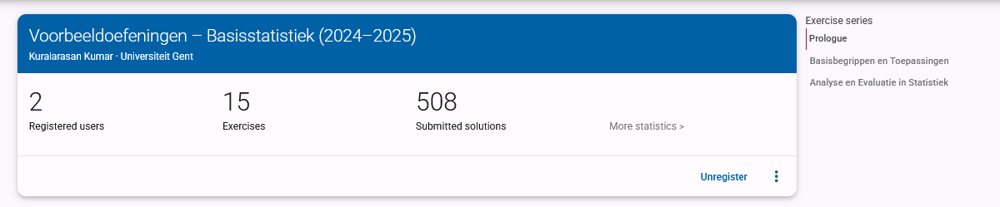
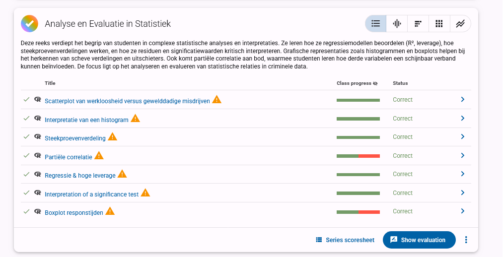

# Dodona Learning Path: Pedagogical & Technical Framework

## Table of Contents
1. [Overview of Learning Goals and Student Needs](#1-overview-of-learning-goals-and-student-needs)
2. [Bloom's Taxonomy Alignment](#2-blooms-taxonomy-alignment)
3. [Learning Design Strategies](#3-learning-design-strategies)
4. [Example Question Elements](#4-example-question-elements)
5. [Annotated Screenshots](#5-annotated-screenshots)
6. [Implementation Details and Technical Considerations](#6-implementation-details-and-technical-considerations)

## 1. Overview of Learning Goals and Student Needs

### Criminology Student Profile
Criminology students typically come from a social science orientation with limited mathematical background. They approach statistics not as abstract mathematical concepts but as practical tools for understanding crime data and social phenomena. These students are often more interested in the application and interpretation of statistical methods within their field rather than theoretical mathematical foundations. Additionally, many criminology students experience statistics anxiety, which can create barriers to learning and decrease confidence in their analytical abilities. This anxiety often stems from previous negative experiences with mathematics or perceived lack of quantitative skills.

### Purpose of the Learning Path
The primary purpose of this learning path is to support the development of statistical reasoning skills using crime-relevant examples and contexts. By embedding statistical concepts within criminological scenarios, the learning path aims to:
- Make abstract statistical concepts more concrete and relevant
- Demonstrate the practical utility of statistics in criminological research and practice
- Build confidence in statistical reasoning through familiar contexts
- Develop critical analytical skills needed for evidence-based criminology
- Bridge the gap between theoretical understanding and practical application
- Support students in overcoming statistics anxiety through contextual relevance

## 2. Bloom's Taxonomy Alignment

### Cognitive Levels
Bloom's Taxonomy provides a hierarchical model of cognitive skills that progresses from lower-order to higher-order thinking skills:
1. **Remember**: Recall facts and basic concepts
2. **Understand**: Explain ideas or concepts
3. **Apply**: Use information in new situations
4. **Analyze**: Draw connections among ideas
5. **Evaluate**: Justify a stand or decision
6. **Create**: Produce new or original work

### Application to Learning Process
The integration of Bloom's Taxonomy into our questions strategically supports criminology students' learning process by:
- **Cognitive Progression**: Building from recall to complex applications, boosting confidence and competence
- **Transfer of Knowledge**: Requiring practical application of concepts in criminological contexts
- **Metacognitive Development**: Encouraging reflection on thinking processes at higher levels
- **Comprehensive Understanding**: Ensuring engagement across all cognitive levels for a holistic grasp
- **Scaffolded Challenges**: Providing appropriate cognitive challenges that build upon prior knowledge
- **Domain-Specific Application**: Applying statistical concepts directly to criminological scenarios

### Question-Bloom Level Mapping
| Question Title | Bloom Level | Cognitive Skill | Learning Intention | Criminology Context |
|----------------|-------------|-----------------|-------------------|---------------------|
| Gemiddelde vs. Mediaan | Understand | Concept comparison | Identify sensitivity to outliers in crime rate data | Crime rates across districts |
| Doel van Beschrijvende Statistiek | Remember | Recall | Differentiate descriptive from inferential statistics | Police report summaries |
| Berekenen van Modus | Apply | Calculation | Calculate mode from crime type frequencies | Common offense categories |
| Chi-kwadraat Interpretatie | Analyze | Interpretation | Interpret chi-square results in demographic contexts | Demographic factors in offending |
| Uitschieters Identificeren | Apply | Data analysis | Identify outliers in crime rate datasets | Unusual crime spikes |
| Standaarddeviatie Vergelijking | Understand | Concept application | Compare variability in crime metrics | Crime pattern consistency |
| Correlatie vs. Causaliteit | Evaluate | Critical thinking | Evaluate claims of variable relationships | Crime and socioeconomic factors |
| Regressieanalyse Interpretatie | Analyze | Interpretation | Interpret regression coefficients in context | Predicting recidivism rates |
| Steekproef Representativiteit | Evaluate | Assessment | Assess sampling biases | Survey of prison populations |
| Betrouwbaarheidsintervallen | Apply | Calculation | Calculate and interpret confidence intervals | Estimating true crime rates |
| p-Waarde Interpretatie | Understand | Concept application | Explain p-values in hypothesis testing | Testing intervention effectiveness |
| Scheve Verdeling Herkennen | Analyze | Pattern recognition | Identify skewed distributions | Income distribution in high-crime areas |
| Type I en Type II Fouten | Evaluate | Critical assessment | Evaluate consequences of statistical errors | False convictions vs. missed offenders |
| Effectgrootte Berekening | Apply | Calculation | Calculate effect sizes | Impact of rehabilitation programs |
| Grafische Weergave Kiezen | Create | Decision making | Choose appropriate data visualizations | Presenting crime trends to stakeholders |

## 3. Learning Design Strategies

### Instructional Design Strategy
The learning path is structured using Bloom's Taxonomy as a cognitive scaffold, progressively building from foundational understanding to higher-order skills like evaluation and creation.

This layered design includes:
- **Concept Reinforcement**: Building foundational understanding (e.g., mean vs. median, descriptive vs. inferential statistics)
- **Calculation Tasks**: Developing technical skills (e.g., chi-square, regression, effect size calculation)
- **Diagnostic Reasoning**: Encouraging critical analysis (e.g., outlier influence, correlation vs. causality)
- **Design/Decision-making**: Fostering application skills (e.g., choosing appropriate visualizations, constructing survey methodologies)

The sequence of questions deliberately moves students through increasing levels of cognitive complexity while maintaining contextual relevance to criminology.

### Scaffolding Techniques
- **Conceptual Prompts**: Short reminders of key ideas without revealing the answer
- **Strategic Questions**: Sub-questions that guide thinking through complex problems
- **Relevant Examples**: Analogous situations to model thinking in criminological contexts
- **Progressive Disclosure**: Stepwise reveal of complexity to prevent cognitive overload
- **Just-in-Time Resources**: Providing support materials at the moment of need
- **Error-Based Learning**: Using common misconceptions as teaching opportunities

### Anxiety Reduction Through Structured Design
The exercise design incorporates several features specifically aimed at reducing statistics anxiety:

- **Incremental Difficulty**: Questions gradually increase in complexity, allowing students to build confidence with early successes before tackling harder concepts
- **Contextualization**: Crime-related scenarios make abstract statistical concepts more concrete and relevant to students' career interests
- **Immediate Feedback**: Detailed, non-judgmental feedback helps students understand errors and reinforces correct thinking patterns
- **Multiple Attempts**: Most exercises allow multiple attempts, reducing the pressure of getting it right the first time
- **Clear Expectations**: Learning objectives are explicitly stated, removing uncertainty about what students are expected to know
- **Visual Supports**: Graphs, tables, and visual elements help students with different learning styles understand complex ideas
- **Consistent Structure**: Predictable exercise formats reduce cognitive load, allowing students to focus on content rather than navigating unfamiliar interfaces

These design elements collectively create a more supportive learning environment that acknowledges and addresses the statistical anxiety many criminology students experience.

### Feedback and Support Elements

#### Example Tips (Dutch)
- "Het gemiddelde is gevoelig voor uitschieters, wat belangrijk is bij het analyseren van misdaadcijfers in wijken met occasionele extreme waarden."
- "Let op: bij een chi-kwadraattoets is de nulhypothese dat er geen verband bestaat tussen de variabelen."
- "Denk aan de formule voor variantie en hoe deze verschillen in criminaliteitscijfers kwantificeert."
- "Een correlatie van 0,7 tussen werkloosheid en misdaad betekent een sterk verband, maar nog geen causaal verband."
- "Bij het interpreteren van p-waarden, onthoud dat 'niet significant' niet hetzelfde is als 'geen effect'."

#### Targeted Feedback
- **Correct Answers**: Confirm logic, extend concepts, connect to real-world application
  - Example: "Juist! De mediaan is inderdaad robuuster tegen uitschieters. Dit is belangrijk bij criminaliteitsanalyse waar incidentele ernstige misdrijven de gemiddeldes kunnen vertekenen."
- **Incorrect Answers**: Clarify misconceptions, explain concepts, and encourage reflection
  - Example: "Niet helemaal. Bij het vergelijken van criminaliteitscijfers over verschillende wijken is het gemiddelde sterk beïnvloed door extreme waarden. In dit geval zou de mediaan een betrouwbaarder beeld geven."

#### Metacognitive Reflection Examples
- "Fout – dit is inferentiële of voorspellende statistiek. Beschrijvende statistiek heeft als doel de data samen te vatten, niet om voorspellingen te maken over de populatie."
- "Je hebt het gemiddelde goed berekend, maar heb je ook nagedacht over hoe representatief dit gemiddelde is gezien de aanwezigheid van uitschieters in de data?"
- "Let op: je hebt de nulhypothese verworpen, maar wat betekent dit in de context van het onderzoek naar het effect van het preventieprogramma?"

#### External Resources
Links to textbook chapters, videos, or slides are added to help students review concepts and fill gaps:
- Video tutorials on interpreting statistical outputs in R
- Infographics explaining key statistical concepts in criminological contexts
- Interactive simulations demonstrating sampling distributions
- Glossary of statistical terms with criminology-specific examples
- Links to relevant sections of the course textbook

## 4. Example Question Elements

### Sample Question
- **Title**: Invloed van Uitschieters op Centrummaten
- **Context**: Inbraakcijfers in 10 wijken in Gent: [5, 7, 6, 8, 5, 9, 6, 7, 40, 7]
- **Scenario**: "Als criminoloog analyseer je inbraakcijfers voor 10 wijken in Gent. Je merkt dat één wijk een opvallend hoog aantal inbraken heeft, mogelijk door een reeks gerichte inbraken door dezelfde dadergroep."
- **Question**: Welke uitspraak is correct over de representativiteit van centrummaten voor deze dataset?
  - A) De mediaan geeft een beter beeld van het "typische" inbraakcijfer omdat deze minder wordt beïnvloed door de uitschieter
  - B) Het gemiddelde geeft een beter beeld van de algemene veiligheidssituatie in Gent
  - C) Beide centrummaten zijn even representatief voor deze dataset
  - D) Geen van beide centrummaten is geschikt voor het analyseren van deze data

### Feedback Logic
- **Correct (A)**: "Juist! De mediaan (7) wordt minder beïnvloed door de extreme waarde van 40 in wijk 9. Het gemiddelde (10) wordt sterk omhoog getrokken door deze uitschieter. Bij het rapporteren van 'typische' inbraakcijfers aan beleidsmakers zou de mediaan een accurater beeld geven van de situatie in de meeste wijken."
- **Incorrect (B)**: "Niet correct. Het gemiddelde (10) wordt sterk beïnvloed door de uitschieter van 40 inbraken in één wijk. Dit geeft een vertekend beeld van de 'typische' wijk, aangezien 9 van de 10 wijken tussen 5-9 inbraken hebben. Voor beleidsbeslissingen zou dit een misleidend beeld geven van de algemene veiligheidssituatie."
- **Incorrect (C)**: "Niet correct. Bij datasets met uitschieters zijn het gemiddelde en de mediaan niet gelijkwaardig. In dit geval is het gemiddelde 10, terwijl de mediaan 7 is. Dit verschil ontstaat door de invloed van de uitschieter (40) op het gemiddelde."
- **Incorrect (D)**: "Niet correct. Hoewel het gemiddelde wordt vertekend door de uitschieter, blijft de mediaan een bruikbare en robuuste maat voor het 'typische' inbraakcijfer. Centrummaten zijn nog steeds waardevol, mits ze correct worden geïnterpreteerd in de context van de datadistributie."

### Hints and Visual Aids
- **Hint 1**: "Bereken zowel het gemiddelde als de mediaan van de inbraakcijfers en vergelijk de resultaten."
- **Hint 2**: "Visualiseer de data met een boxplot om de positie van de uitschieter ten opzichte van de rest van de data te zien."
- **Hint 3**: "Overweeg hoe je deze informatie zou presenteren aan gemeenteraadsleden die beslissingen moeten nemen over de inzet van politiemiddelen."
- **Visual**: Boxplot with outlier marked at 40, with annotations showing the effect on mean vs. median
- **Supplementary Visual**: Histogram of the same data showing the skewed distribution

## 5. Annotated Screenshots

This visual overview provides selected exercises from the Dodona learning path for criminology students. Each section includes the screenshot, its content description, and relevant pedagogical context.

### Course Structure

#### 1. Series Overview – Part 1

**Description:** Shows the top portion of the full exercise series within the 'Basisstatistiek' course on Dodona.

**Purpose:** Highlights the structure and entry point of the course, where students see the learning objectives and can track their progress.

---

#### 2. Series Overview – Part 2

**Description:** Displays the middle section of the course, including the first part: *Basisbegrippen en Toepassingen*.

**Purpose:** Demonstrates the progressive introduction of fundamental statistical concepts (e.g., measurement levels, crime rate, correlation). Most exercises here are aligned with Bloom's levels: Remember, Understand, and Apply.

---

#### 3. Series Overview – Part 3

**Description:** Covers the final section *Analyse en Evaluatie in Statistiek*, including advanced interpretation tasks (e.g., boxplots, leverage, spurious correlation).

**Purpose:** This section supports higher-order thinking with questions that target Bloom's levels: Analyze and Evaluate. It encourages students to interpret patterns, detect outliers, and assess methodological choices using realistic data.

### Performance Monitoring

#### 4. Score Summary (Total Overview)

**Description:** This shows the overall completion status for each user across the three sections.

**Purpose:** Allows monitoring of student progress and identifies where further scaffolding or support may be needed.

---

#### 5. Score Summary – Basic Concepts

**Description:** This view provides insight into user performance on foundational concepts like measurement levels and descriptive statistics.

**Purpose:** Helps identify specific strengths and weaknesses in early-stage comprehension.

---

#### 6. Score Summary – Analysis and Evaluation

**Description:** This section reflects progress on more complex tasks such as regression, outliers, and statistical inference.

**Purpose:** Highlights students' abilities to apply and evaluate statistical models using criminological data.

### Example Exercises

#### 7. Crime Rate Calculation Exercise

**Description:** A simple question asking students to calculate crime rate per 1,000 inhabitants.

**Purpose:** Trains students in basic rate calculation using real-world population and crime data.

---

#### 8. Descriptive vs Inferential Statistics

**Description:** This question checks understanding of the distinction between summarizing data and making predictions.

**Purpose:** Reinforces conceptual clarity on the purpose of statistical approaches.

---

#### 9. Hypothesis Testing Exercise

**Description:** A multimedia-supported question prompting students to define the correct null hypothesis.

**Purpose:** Introduces inferential statistics with visual support, helping explain abstract ideas.

---

#### 10. Histogram Interpretation

**Description:** Asks students to interpret the shape and distribution from a histogram of participant ages.

**Purpose:** Promotes data literacy and visual interpretation skills.

### Feedback Examples

#### 11. Outlier Identification (Correct Answer)

**Description:** Demonstrates how feedback is presented when students correctly identify a statistical outlier.

**Purpose:** Confirms correct reasoning with step-by-step solution and statistical justification (Z-score logic).

---

#### 12. Outlier Identification (Incorrect Answer)

**Description:** Illustrates how detailed feedback is used to correct misunderstandings.

**Purpose:** Leverages feedback as a learning opportunity by explaining why an answer is incorrect.

## 6. Implementation Details and Technical Considerations

### Technical Framework
The Dodona learning path is implemented using a combination of:
- **R scripts** for automated answer validation and feedback generation
- **Markdown** for content presentation and formatting
- **JSON configuration** files for exercise parameters and settings

### Accessibility Considerations
- **Language Support**: All content is available in Dutch, with terminology carefully chosen to align with students' prior knowledge
- **Visual Alternatives**: Text descriptions accompany all graphs and visual elements
- **Progressive Complexity**: Questions are designed to be accessible to students with different levels of statistical background

### Assessment Integration
- **Auto-grading**: Exercises are automatically evaluated with detailed feedback
- **Progress Tracking**: Student completion rates and performance metrics are tracked
- **Instructor Dashboard**: Faculty can monitor class progress and identify common misconceptions

### Future Development
Planned enhancements to the learning path include:
- Integration with R Studio for more complex data analysis exercises
- Expansion of the exercise set to cover advanced multivariate statistical methods
- Development of adaptive learning pathways that adjust to individual student performance
- Creation of collaborative exercises that encourage peer learning and discussion

This learning path represents an ongoing effort to improve statistical education for criminology students by combining technical accuracy with pedagogical insight, creating an inclusive learning environment where students build confidence through meaningful engagement with statistical concepts.
