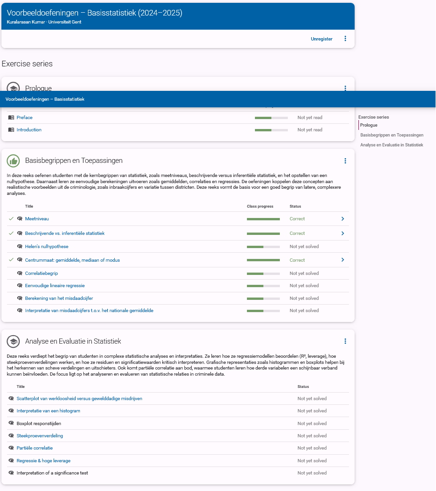

## 1. Series Overview Screenshot

**Description:**  
This screenshot shows the full exercise series within the "Basisstatistiek" course. It includes three sections: *Prologue*, *Basisbegrippen en Toepassingen*, and *Analyse en Evaluatie in Statistiek*.

**Purpose:**  
Gives students a structured learning path from foundational to advanced statistical reasoning.
