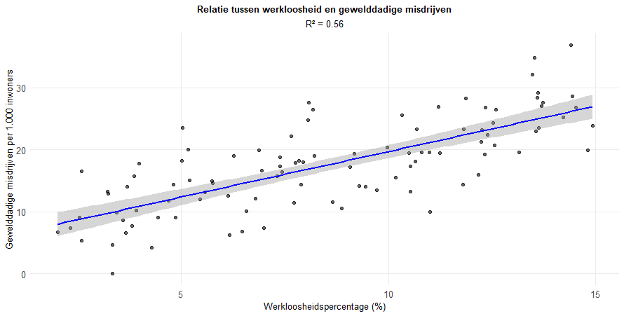

In een scatterplot van werkloosheid (x) versus gewelddadige misdrijven (y) is de regressielijn positief en R² = 0,33. Wat betekent R² = 0,33?

 

1.	Het model voorspelt 33% van de wijken correct
2.	33% van de misdrijven wordt veroorzaakt door werkloosheid
3.	Werkloosheid en misdaad zijn perfect gecorreleerd
4.	33% van de variantie in gewelddadige misdrijven tussen wijken wordt verklaard door werkloosheid

Typ je antwoord als één enkel getal (1-4) om je keuze aan te geven.

