# Basisbegrippen in de Correlation

## 📋 OVERZICHTSTABEL - VRAGEN VOLGENS BLOOM'S TAXONOMIE (25 VRAGEN)

### ONTHOUDEN NIVEAU (5 vragen - 20%)
| Vraagnummer | Vraag Titel | Leerintentie |
|-------------|-------------|--------------|
| Q1 | Wat is correlatie? | Definitie van correlatie herinneren |
| Q2 | Wat is een z-score? | Z-score definitie herinneren |
| Q3 | Belangrijkste maatregelen in verband | Belangrijke correlatiematen herinneren |
| Q4 | Centrum in z-Scores | Centrum van gestandaardiseerde verdeling herinneren |
| Q5 | Eenheden veranderen niet r | Invariantie van correlatie voor eenheden herinneren |

### NIVEAU BEGRIJPEN (13 vragen - 52%)
| Vraagnummer | Vraag Titel | Leerintentie |
|-------------|-------------|--------------|
| Q6 | Variabeletypen voor correlatie | Variabeletypes voor correlatie begrijpen |
| Q7 | Basisprincipes van correlatie versus causaliteit | Verschil correlatie-causatie begrijpen |
| Q8 | Correlatiewaarden interpreteren | Correlatie-interpretatie begrijpen |
| Q9 | Richting van relaties | Richting van verbanden begrijpen |
| Q10 | Wat vertelt correlatie ons? | Wat correlatie betekent begrijpen |
| Q11 | Visualisatie belang | Belang van visualisatie begrijpen |
| Q12 | Covariantie versus correlatie | Verschil covariantie-correlatie begrijpen |
| Q13 | Beschrijf het patroon | Patroonbeschrijving begrijpen |
| Q17 | Correlatie types | Verschillende correlatie types begrijpen |
| Q18 | Wanneer welke correlatie gebruiken | Correlatie types toepassing begrijpen |
| Q20 | Waarom standardisatie nodig is | Standardisatie noodzaak begrijpen |
| Q21 | Correlatie interpretatie | Correlatie interpretatie begrijpen |
| Q23 | Correlatie veronderstellingen | Correlatie aannames begrijpen |

### TOEPASSEN NIVEAU (3 vragen - 12%)
| Vraagnummer | Vraag Titel | Leerintentie |
|-------------|-------------|--------------|
| Q14 | Monotoon vs. lineair | Monotoon versus lineair toepassen |
| Q15 | Richting en kracht | Richting en sterkte bepalen |
| Q16 | Zwak positief | Zwak positieve correlatie herkennen |

### ANALYSEER NIVEAU (1 vraag - 4%)
| Vraagnummer | Vraag Titel | Leerintentie |
|-------------|-------------|--------------|
| Q19 | Impact van uitschieters | Impact van uitbijters analyseren |

### NIVEAU EVALUEREN (1 vraag - 4%)
| Vraagnummer | Vraag Titel | Leerintentie |
|-------------|-------------|--------------|
| Q22 | Statistische declaraties beoordelen | Statistische claims beoordelen |

### CREATIE NIVEAU (2 vragen - 8%)
| Vraagnummer | Vraag Titel | Leerintentie |
|-------------|-------------|--------------|
| Q24 | Ontwerp een correlatiestudie | Correlatiestudie ontwerpen |
| Q25 | Onderzoekshypothese opstellen | Onderzoekshypothese formuleren |

# Correlatie - Verbeterd met visueel leren

Deze beoordeling omvat correlatieconcepten die essentieel zijn voor criminologische statistieken. Het bestand bevat zorgvuldig gestructureerde vragen op verschillende cognitieve niveaus, met visuele voorbeelden, praktische toepassingen en gedetailleerde feedback voor optimaal leren.

## Visuele leergids

### Correlatiepatronen begrijpen door middel van spreidingsdiagrammen

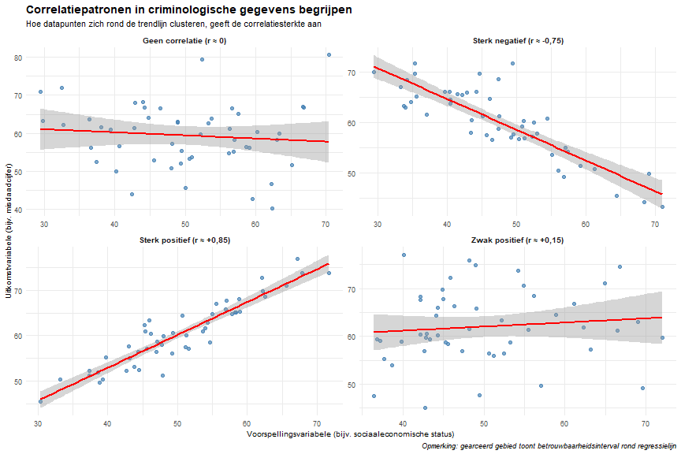

**Belangrijkste interpretatiepunten:**
- **Sterk positief**: Punten clusteren zich strak rond een opwaarts hellende lijn
- **Sterk negatief**: Punten clusteren zich strak rond de neerwaarts hellende lijn  
- **Zwakke correlatie**: Punten wijd verspreid rond de trendlijn
- **Geen correlatie**: Geen waarneembaar lineair patroon, vlakke of chaotische opstelling

## Interpretatiegids voor criminologisch onderzoek

### Richtlijnen voor effectgrootte (Cohen's conventies)
- **Kleine correlatie**: r = .10 (1% van de variantie verklaard)
- **Gemiddelde correlatie**: r = .30 (9% van de variantie verklaard)  
- **Grote correlatie**: r = .50 (25% van de variantie verklaard)

### Praktische significantie versus statistische significantie
- **Statistische significantie**: p < .05 (relatie onwaarschijnlijk door toeval)
- **Praktische betekenis**: Effectgrootte groot genoeg om er toe te doen in toepassingen in de echte wereld
- **Voorbeeld**: r = .15, p < .001 in een grote steekproef kunnen statistisch significant zijn, maar praktisch klein

### Veelvoorkomende interpretatievalkuilen
1. **Correlatie ≠ oorzakelijk verband**: Hoge correlatie bewijst niet dat de ene variabele de andere veroorzaakt
2. **Derde variabele**: Alternatieve verklaringen kunnen de waargenomen relaties verklaren
3. **Beperking van het bereik**: Beperkte variabiliteit kan correlaties kunstmatig verminderen
4. **Uitschieters**: Extreme scores kunnen de correlatiecoëfficiënten opblazen of laten leeglopen
5. **Niet-lineaire relaties**: Correlatie veronderstelt lineaire associaties
---

# Correlatievragen (25 in totaal)

## ONTHOUDEN NIVEAU (5 vragen)

### Vraag Q1 (Onthouden)
**Wat is correlatie?**

> Hint: Denk na over hoe twee criminologische variabelen samen bewegen - bijvoorbeeld werkloosheid en misdaadcijfers - niet over oorzaak en gevolg.

Een maat voor de mate waarin de ene variabele de andere veroorzaakt
"1" = " ❌ Onjuist. Dit is een veel voorkomende misvatting in criminologisch onderzoek. Correlatie laat zien dat twee variabelen samen veranderen, maar het bewijst niet dat de ene de andere veroorzaakt. Buurten met een hoge werkloosheid hebben bijvoorbeeld vaak hogere misdaadcijfers, maar dit kan het gevolg zijn van een derde factor, zoals armoede, sociale desorganisatie of zwakke informele controle."

Een statistische maat voor de sterkte en richting van de relatie tussen twee variabelen
"2" = " ✅ Juist! Correlatie kwantificeert hoe sterk en in welke richting twee kwantitatieve variabelen met elkaar in verband staan. Een positieve correlatie (bijv. r = +0,68 tussen werkloosheid en vermogenscriminaliteit) betekent dat hogere werkloosheid gepaard gaat met hogere criminaliteit, terwijl een negatieve correlatie (bijv. r = –0,55 tussen zichtbaarheid van de politie en wanorde) betekent dat naarmate de ene toeneemt, de andere afneemt."

Het verschil tussen twee variabelen
"3" = " ❌ Onjuist. Het nemen van een verschil (Y - X) meet alleen een kloof, niet of de variabelen samen variëren. Het verschil tussen diefstal- en mishandelingspercentages zegt bijvoorbeeld niets over de vraag of deze misdaden samen stijgen of dalen. Correlatie onderzoekt co-variatie - hoeveel beide variabelen afwijken van hun gemiddelden in dezelfde of tegengestelde richting."

Een methode om toekomstige waarden te voorspellen
"4" = " ❌ Onjuist. Dat is regressieanalyse, geen correlatie. Regressie stelt criminologen in staat om bijvoorbeeld het verwachte misdaadcijfer voor een bepaald werkloosheidsniveau te voorspellen. Correlatie vat alleen samen hoe twee variabelen op een bepaald moment in de tijd met elkaar in verband staan - het kan geen voorspellingen doen of oorzakelijk verband bewijzen."

---

### Vraag Q2 (Onthouden)
**Wat is een z-score?**

> **Hint:** Denk na over het vergelijken van misdaadstatistieken in verschillende rechtsgebieden of tijdsperioden - hoe weten we of een misdaadcijfer ongewoon hoog of laag is in vergelijking met het typische patroon?

1) De ruwe score minus het gemiddelde  
"1" = " ❌ Onjuist. Dit geeft u een afwijkingsscore, die aangeeft hoe ver boven of onder het gemiddelde een waarde is, maar geen rekening houdt met de variabiliteit in uw gegevens. Als het gemiddelde misdaadcijfer bijvoorbeeld 50 per 1.000 is en een stad 60 per 1.000 heeft, is de afwijking +10. Maar we kunnen niet beoordelen of dit 'veel' is zonder te weten of misdaadcijfers doorgaans variëren met ±2 of ±20 rond het gemiddelde. De z-score standaardiseert dit door te delen door de standaarddeviatie."

2) Een score die aangeeft hoeveel standaarddeviaties een waarde is ten opzichte van het gemiddelde  
"2" = " ✅ Juist! Z-scores standaardiseren waarden met behulp van de formule z = (X - μ)/σ, waardoor zinvolle vergelijkingen tussen verschillende variabelen of tijdsperioden mogelijk zijn. Als het geweldsmisdrijfcijfer van een stad bijvoorbeeld z = +2,1 heeft, betekent dit dat het 2,1 standaarddeviaties boven het gemiddelde voor alle steden ligt - een ongewoon hoog percentage. Met Z-scores kunnen we vergelijken 'hoe ongebruikelijk' verschillende soorten criminaliteit zijn: een inbraakcijfer met z = +1,5 en een mishandelingspercentage met z = +0,8 duiden beide op bovengemiddelde criminaliteit, maar inbraak is extreem hoog."

3) Het percentage boven het gemiddelde  
"3" = " ❌ Onjuist. Z-scores worden uitgedrukt in standaarddeviatie-eenheden, niet in percentages. Z-scores kunnen echter worden geconverteerd naar percentielen met behulp van de normale verdeling. z = +1,0 komt bijvoorbeeld overeen met ongeveer het 84e percentiel (wat betekent dat 84% van de waarden onder dit punt valt), maar de z-score zelf is geen percentage. In de criminologie is dit onderscheid van belang bij het interpreteren van risicobeoordelingen of het vergelijken van misdaadstatistieken in verschillende rechtsgebieden."

4) Het kwadraat van de originele partituur  
"4" = " ❌ Onjuist. Het kwadrateren van een score zou de schaal drastisch veranderen en informatie verliezen over de vraag of de oorspronkelijke waarde boven of onder het gemiddelde lag. Z-scores behouden de relatieve positie terwijl ze de schaal standaardiseren. Als we de misdaadcijfers in het kwadraat zouden brengen, zou een stad met 100 misdaden per 1.000 10.000 worden - waardoor de betekenis volledig zou veranderen en vergelijkingen onmogelijk zouden worden."

---

### Vraag Q3 (Onthouden)
**Wat zijn de belangrijkste maatregelen in correlatieanalyse?**

> **Hint:** Bij het bestuderen van de relatie tussen twee misdaadgerelateerde variabelen, welke statistieken heb je dan nodig om de associatie volledig te begrijpen en te rapporteren?


Table: Correlatiematrix: belangrijkste misdaadvariabelen

|                | Police_Presence| Drug_Offenses| Violent_Crime| Property_Crime|
|:---------------|---------------:|-------------:|-------------:|--------------:|
|Police_Presence |            1.00|          0.05|          0.06|          -0.11|
|Drug_Offenses   |            0.05|          1.00|          0.09|           0.15|
|Violent_Crime   |            0.06|          0.09|          1.00|           0.13|
|Property_Crime  |           -0.11|          0.15|          0.13|           1.00|

**Voorbeeld van volledige correlatierapportage:**
- De aanwezigheid van de politie is negatief geassocieerd met drugsdelicten (r = -0,48, R² = 0,23, n = 40), wat aangeeft dat 23% van de variantie in drugsdelicten wordt verklaard door de aanwezigheid van de politie.
- De steekproefomvang (n = 40) biedt voldoende statistische power om matige correlaties te detecteren.

1) Alleen de correlatiecoëfficiënt (r)  
"1" = " ❌ Onjuist. Hoewel r de primaire maatstaf is, levert het rapporteren van alleen r onvolledige informatie op voor criminologisch onderzoek. U moet ook weten hoeveel variantie wordt verklaard (R²) en of uw steekproefomvang (n) groot genoeg is om het resultaat te vertrouwen. R = 0,40 tussen aanwezigheid van de politie en misdaadvermindering lijkt bijvoorbeeld zinvol, maar als n = 8 steden, is het resultaat onbetrouwbaar. Professioneel criminologisch onderzoek vereist het rapporteren van alle drie de statistieken."

2) Correlatiecoëfficiënt (r), bepalingscoëfficiënt (R²) en steekproefomvang (n)  
"2" = " ✅ Juist! Deze drie geven volledige informatie over de relatie. De correlatiecoëfficiënt (r) geeft de sterkte en richting aan (-1 tot +1), R² geeft het verklaarde variantiepercentage aan (r² × 100%) en de steekproefomvang (n) geeft betrouwbaarheid aan. Bijvoorbeeld: 'De zichtbaarheid en wanorde van de politie vertoonden een matige negatieve correlatie (r = -0,45, R² = 0,20, n = 150 buurten), wat aangeeft dat 20% van de variatie in wanorde kan worden verklaard door de aanwezigheid van de politie.' Dit geeft lezers alle informatie die nodig is om de bevinding te evalueren."

3) Alleen het gemiddelde en de standaarddeviatie  
"3" = " ❌ Onjuist. Gemiddelden en standaarddeviaties beschrijven individuele variabelen, maar geven niet de relatie tussen twee variabelen weer. Je zou identieke gemiddelden en standaarddeviaties kunnen hebben voor werkloosheids- en misdaadcijfers in twee verschillende onderzoeken, maar totaal verschillende correlaties (r = +0,80 vs. r = -0,20). Correlatieanalyse onderzoekt specifiek hoe variabelen samen variëren, wat andere statistieken vereist dan eenvoudige beschrijvende metingen."

4) De helling en het snijpunt  
"4" = " ❌ Onjuist. Helling en snijpunt zijn regressieparameters, geen correlatiematen. Hoewel regressie en correlatie gerelateerd zijn (helling = r × sy/sx), dienen ze verschillende doelen. Correlatie vat de kracht van associatie samen; Regressie biedt voorspellingsvergelijkingen. In de criminologie zou je correlatie kunnen rapporteren bij het bestuderen of twee soorten criminaliteit de neiging hebben om samen voor te komen, maar regressie bij het voorspellen van toekomstige misdaadcijfers op basis van demografische factoren."

---

### Vraag Q4 (Onthouden)
**Waar ligt het 'zwaartepunt' in een gestandaardiseerd (z-score) spreidingsdiagram?**

> **Hint:** Wanneer je misdaadvariabelen omrekent naar z-scores (bijv. gestandaardiseerde inbraakcijfers en gestandaardiseerde werkloosheidscijfers), waar kruisen de middelen elkaar dan?

1) (0, 0) — snijpunt van gemiddelde lijnen  
"1" = " ✅ Juist! Wanneer variabelen worden gestandaardiseerd op z-scores, worden beide gemiddelden 0, dus het bivariate centrum is (0,0). Dit is uiterst nuttig in criminologisch onderzoek voor het visueel interpreteren van correlaties. In een z-score spreidingsdiagram van werkloosheid versus misdaadcijfers staat het punt (0,0) voor de gemiddelde werkloosheid en de gemiddelde criminaliteit. Punten in het kwadrant rechtsboven (beide positief) staan voor bovengemiddelde werkloosheid EN bovengemiddelde criminaliteit, terwijl punten linksonder (beide negatief) staan voor werkloosheid onder het gemiddelde EN criminaliteit onder het gemiddelde. De clustering van punten rond dit (0,0) centrum helpt bij het visualiseren van de correlatiesterkte."

2) (1, 1) — één standaardafwijkingspunt  
"2" = " ❌ Onjuist. Het punt (1,1) vertegenwoordigt een locatie waar beide variabelen één standaarddeviatie boven hun gemiddelde liggen - dit is niet het centrum van de verdeling. Als je in een criminologische context kijkt naar gestandaardiseerde politieaanwezigheid en misdaadcijfers, zou (1,1) een gemeenschap vertegenwoordigen met zowel een hoge politieaanwezigheid (z = +1) als hoge criminaliteit (z = +1) - wat mogelijk aangeeft dat de politie reactief wordt ingezet in gebieden met veel criminaliteit. Dit is misschien een interessant datapunt, maar het is niet het zwaartepunt."

3) Het dichtste deel van de cloud  
"3" = " ❌ Onjuist. Het 'dichtste deel' verwijst naar de modus (meest voorkomende gebied), die niet noodzakelijkerwijs het gemiddelde centrum is. In criminologische gegevens kan de modus worden vertekend door clustereffecten - bijvoorbeeld als veel landelijke provincies vergelijkbare lage misdaadcijfers hebben, waardoor een dichte cluster ontstaat die ver van het gemiddelde ligt. Het zwaartepunt wordt bepaald door middelen, niet door waar de meeste datapunten clusteren. Dit onderscheid is van belang bij het interpreteren van uitschieters zoals grote steden met extreme misdaadcijfers."

4) Het meest waargenomen punt  
"4" = " ❌ Onjuist. Dit beschrijft de modus, niet het gemiddelde. In criminologisch onderzoek clusteren gegevens zelden op precies één punt vanwege de meetprecisie en natuurlijke variatie. Bijvoorbeeld, zelfs als veel buurten 'ongeveer 5 misdaden per 1,000' hebben, kunnen de exacte waarden 4.8, 5.1, 4.9, enz. zijn. Het gemiddelde centrum (0,0) in de gestandaardiseerde ruimte vertegenwoordigt het evenwichtspunt van alle gegevens, niet de meest voorkomende waarde."

---

### Vraag Q5 (Onthouden)
**Je schakelt X van meters naar centimeters. Wat gebeurt er met r(X,Y)?**

> **Hint:** Als je de afstand van politiepatrouilles meet in meters versus centimeters, of misdaadcijfers per 1.000 versus per 100.000 inwoners, hoe beïnvloedt dit dan de correlatie met andere variabelen?

1) r wordt 100× groter  
"1" = " ❌ Onjuist. Eenheden hebben geen invloed op de correlatiemagnitude. Dit is een cruciale eigenschap voor criminologisch onderzoek waarbij variabelen vaak verschillende schalen gebruiken. De correlatie tussen 'jaren onderwijs' en 'arrestaties per 1.000 inwoners' zou bijvoorbeeld hetzelfde zijn als de correlatie tussen 'jaren onderwijs' en 'arrestaties per 100.000 inwoners'. De schaalverandering verandert niets aan de onderliggende relatiesterkte. Als veranderende eenheden de correlatie zouden beïnvloeden, zou vergelijkend criminologisch onderzoek in landen met verschillende meetsystemen onmogelijk zijn."

2) r wordt 100× kleiner  
"2" = " ❌ Onjuist. Nogmaals, correlatie is schaalinvariant. Of u nu de reactietijd van patrouillewagens meet in seconden, minuten of uren, de correlatie met de opruimingspercentages van misdrijven blijft identiek. Deze eigenschap maakt correlatie bijzonder waardevol voor internationale criminologische vergelijkingen - onderzoekers kunnen gegevens gebruiken die in verschillende eenheden zijn gemeten zonder wiskundige aanpassingen. De relatiesterkte tussen twee variabelen is onafhankelijk van hoe die variabelen worden geschaald."

3) r blijft precies hetzelfde  
"3" = " ✅ Juist! Correlatie is eenheidsvrij en invariant voor lineaire herschaling. Dit komt omdat correlatie beide variabelen tijdens de berekening standaardiseert - het meet hoe variabelen samen bewegen ten opzichte van hun eigen variabiliteit, ongeacht de eenheden. In de criminologie betekent dit dat je correlaties kunt vergelijken tussen onderzoeken die verschillende meetschalen gebruiken. Studies die bijvoorbeeld misdaadcijfers per hoofd van de bevolking versus per vierkante kilometer meten, kunnen nog steeds vergelijkbare correlatiecoëfficiënten hebben met demografische factoren. Deze invariantie-eigenschap maakt correlatie tot een universele maat voor associatie."

4) r wordt negatief  
"4" = " ❌ Onjuist. Veranderingen in eenheden kunnen de richting van een relatie niet omdraaien. Als een verhoogde aanwezigheid van de politie gepaard gaat met een verminderde criminaliteit (negatieve correlatie), blijft deze relatierichting hetzelfde, of je nu de aanwezigheid van agenten per blok, per vierkante kilometer of per 1.000 inwoners meet. Alleen de schaal verandert, niet het fundamentele patroon. Een sign flip zou duiden op een heel andere substantiële relatie, die eenheidsconversie niet kan veroorzaken."

---

## BEGRIJPEN NIVEAU (8 vragen)

### Vraag Q6 (Begrijpen)
**Voor welke soorten variabelen kunt u de Pearson-correlatie berekenen?**

> Hint: Overweeg of je de correlatie tussen verschillende soorten criminologische variabelen zinvol kunt berekenen - kun je geslacht correleren met misdaadcijfers? Lengte van de gevangenisstraf met kans op recidive?

1) Alleen categorische variabelen  
"1" = " ❌ Onjuist. Pearson-correlatie vereist numerieke variabelen waarbij wiskundige bewerkingen (optellen, aftrekken, middelen) zinvol zijn. Categorische variabelen zoals 'type misdaad' (gewelddadig, eigendom, drugs) of 'gerechtelijke beschikking' (schuldig, niet schuldig, pleidooi) hebben geen inherente numerieke waarden. Je kunt geen zinvol gemiddelde berekenen van 'gewelddadige' en 'eigendomsdelicten'. Voor categorische variabelen zou je verschillende maten gebruiken, zoals de V- of Chi-kwadraattest van Cramér om associaties te onderzoeken."

2) Beide variabelen moeten continu zijn (interval- of rationiveau)  
"2" = " ✅ Juist! Pearson-correlatie vereist dat beide variabelen worden gemeten op interval- of rationiveau - numerieke variabelen waarbij de afstanden tussen waarden zinvol en consistent zijn. In de criminologie zijn voorbeelden: misdaadcijfers (ratio), strafduur in maanden (ratio), leeftijd bij eerste arrestatie (ratio), aantal eerdere veroordelingen (ratio) en schalen die de houding ten opzichte van de politie meten (interval). Deze variabelen maken zinvolle wiskundige bewerkingen mogelijk die nodig zijn voor het berekenen van gemiddelden, standaarddeviaties en covarianties die de basis vormen van de Pearson-correlatie."

3) Een categorische en een continue variabele  
"3" = " ❌ Onjuist. Als u één categorische en één continue variabele hebt, gebruikt u punt-biseriële correlatie (voor binaire categorieën) of eta-correlatie (voor meerdere categorieën). Als je bijvoorbeeld de relatie tussen geslacht (categorisch: man/vrouw) en het aantal arrestaties (continu) bestudeert, zou je punt-biseriële correlatie gebruiken. Als je de relatie tussen het type buurt (categorisch: stedelijk/voorstedelijk/landelijk) en het misdaadcijfer (continu) onderzoekt, zou je ANOVA- of eta-correlatie kunnen gebruiken in plaats van Pearson-correlatie."

4) Elk type variabelen  
"4" = " ❌ Onjuist. Er bestaan verschillende correlatiematen voor verschillende variabelecombinaties. Pearson-correlatie is specifiek voor continue variabelen. Andere metingen zijn: Spearman's rho voor gerangschikte gegevens, phi-coëfficiënt voor twee binaire variabelen, Cramér's V voor twee categorische variabelen en point-biserial voor één binaire en één continue variabele. Het gebruik van het verkeerde correlatietype kan leiden tot nietszeggende resultaten of ernstige verkeerde interpretaties van relaties in criminologisch onderzoek."

---

### Vraag Q7 (Begrijpen)
**Waarom bewijst correlatie geen causatie?**

> **Hint:** Overweeg waarom een sterke correlatie tussen ijsverkoop en verdrinkingsdoden, of tussen het aantal politieagenten en misdaadcijfers, niet noodzakelijk betekent dat het ene het andere veroorzaakt.

1) Correlatie is altijd te zwak om iets te bewijzen  
"1" = " ❌ Onjuist. Zelfs zeer sterke correlaties (r = 0,90 of hoger) bewijzen geen causaal verband. Het probleem is niet de sterkte van de correlatie, maar de logica van causale inferentie. In de criminologie kunt u een zeer sterke correlatie (r = 0,85) vinden tussen het aantal beveiligingscamera's in een buurt en misdaadcijfers, maar dit bewijst niet dat camera's criminaliteit veroorzaken. De hoge correlatie kan bestaan omdat camera's worden geïnstalleerd als reactie op hoge criminaliteit, niet omdat camera's criminaliteit veroorzaken. Correlatiesterkte en causaal bewijs zijn compleet gescheiden kwesties."

2) Derde variabelen, omgekeerde causaliteit of toeval kunnen de relatie verklaren  
"2" = " ✅ Juist! Correlatie kan geen causale richting vaststellen of alternatieve verklaringen uitsluiten. In de criminologie: (1) Derde variabelen — armoede kan zowel een laag opleidingsniveau als hoge criminaliteit veroorzaken, wat een schijncorrelatie tussen onderwijs en criminaliteit creëert; (2) Omgekeerde causaliteit — verminderen meer politieagenten de criminaliteit, of leidt meer criminaliteit tot het aannemen van meer politie? (3) Toeval — twee variabelen kunnen per toeval correleren, vooral bij kleine steekproeven. Het vaststellen van causaliteit vereist gecontroleerde experimenten, longitudinale ontwerpen, natuurlijke experimenten of geavanceerde statistische technieken die causale effecten kunnen isoleren van deze alternatieve verklaringen."

3) Alleen experimenten kunnen relaties aantonen  
"3" = " ❌ Onjuist. Correlatie toont duidelijk aan dat relaties bestaan — het kan alleen niet bepalen of ze causaal zijn. Veel belangrijke criminologische relaties kunnen om ethische redenen niet experimenteel worden bestudeerd (je kunt mensen niet willekeurig toewijzen aan criminele carrières). Correlationele studies leveren waardevol bewijs over associaties, risicofactoren en patronen. Hoewel experimenten het sterkste causale bewijs leveren, kunnen observationele studies met technieken zoals instrumentele variabelen, regressiediscontinuïteit of natuurlijke experimenten ook overtuigend causaal bewijs leveren wanneer experimenten niet haalbaar zijn."

4) Correlatie is hetzelfde als causaliteit  
"4" = " ❌ Onjuist. Dit is precies het misverstand dat criminologen moeten vermijden. Media-berichten beweren vaak 'studies tonen aan dat X Y veroorzaakt' wanneer het onderzoek alleen correlatie heeft aangetoond. Het vinden dat wijken met meer straatverlichting minder criminaliteit hebben, bewijst bijvoorbeeld niet dat straatverlichting criminaliteit voorkomt — veiligere wijken kunnen simpelweg meer geneigd zijn om straatverlichting te installeren. Het begrijpen van dit onderscheid is cruciaal voor evidence-based strafrechtelijk beleid, aangezien het implementeren van interventies op basis van alleen correlationeel bewijs middelen kan verspillen of zelfs averechts kan werken."

---

### Vraag Q8 (Begrijpen)
**Een criminoloog onderzoekt de relatie tussen buurt sociale cohesie en misdaadpreventie effectiviteit in 75 Nederlandse gemeenten. Na het verzamelen van data over gemeenschapsbetrokkenheid en lokale veiligheidsprogramma's, berekent ze een correlatie van r = 0,75. Hoe moet zij deze bevinding interpreteren voor haar rapport aan het Ministerie van Justitie en Veiligheid?**

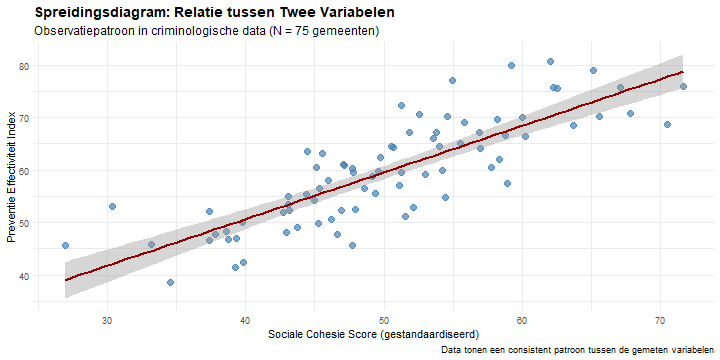

> **Hint:** Overweeg wat een correlatie van r = 0,75 betekent in termen van relatiesterkte, praktische betekenis voor beleid, en hoe dit zou moeten worden gecommuniceerd aan beleidsmakers.

1) Zwakke positieve relatie - minimale beleidsimplicaties  
"1" = " ❌ Onjuist. Een r = 0,75 vertegenwoordigt een sterke relatie, niet zwak. In criminologisch onderzoek worden correlaties rond 0,75 als behoorlijk substantieel beschouwd. Ter vergelijking: de correlatie tussen lengte en gewicht bij volwassenen is typisch rond 0,70-0,80. Als je r = 0,75 vond tussen buurt sociale cohesie en misdaadpreventie effectiviteit, zou dit wijzen op een sterk positief verband — als sociale cohesie toeneemt, neigen preventie programma's aanzienlijk effectiever te worden. Dit correlatieniveau suggereert dat de variabelen ongeveer 56% van hun variantie delen (0,75² = 0,56), wat aanzienlijk is in sociaalwetenschappelijk onderzoek en belangrijke beleidsimplicaties heeft."

2) Sterke positieve relatie - significante bevinding voor preventiebeleid  
"2" = " ✅ Juist! Waarden rond 0,7-0,8 geven sterke positieve associaties aan in sociaalwetenschappelijk onderzoek. Een r = 0,75 betekent dat wanneer sociale cohesie toeneemt, de effectiviteit van preventie programma's substantieel toeneemt in een voorspelbaar patroon. In de Nederlandse criminologie context kan dit de empirische basis bieden voor investeringen in gemeenschapsopbouw als onderdeel van misdaadpreventie strategieën. De relatie is sterk genoeg om praktisch betekenisvol te zijn voor beleid en voorspelling, waarbij sociale cohesie ongeveer 56% van de variantie in preventie effectiviteit verklaart. Dit suggereert dat gemeenten met sterkere sociale bindingen waarschijnlijk meer succesvol zijn met hun veiligheidsprogramma's."

3) Perfecte negatieve relatie - tegengesteld effect van verwachting  
"3" = " ❌ Onjuist. Deze interpretatie heeft twee grote fouten: (1) r = 0,75 is positief, niet negatief — de waarde ligt boven nul, wat aangeeft dat variabelen in dezelfde richting bewegen; (2) 0,75 is sterk maar niet perfect — een perfecte correlatie zou r = ±1,00 zijn. Een perfecte negatieve correlatie (r = -1,00) betekent dat wanneer sociale cohesie toeneemt, preventie effectiviteit in exact dezelfde verhouding afneemt, zonder uitzonderingen. In de criminologie zijn perfecte correlaties vrijwel onmogelijk vanwege de complexiteit van sociale fenomenen en meetfouten."

4) Geen betekenisvolle relatie - resultaten zijn statistisch ruis  
"4" = " ❌ Onjuist. Een r = 0,75 geeft een sterke en betekenisvolle relatie aan, niet de afwezigheid ervan of statistische ruis. 'Geen relatie' zou worden aangegeven door r ≈ 0,00. Om r = 0,75 in perspectief te plaatsen: veel belangrijke relaties in de criminologie zijn zwakker dan dit — bijvoorbeeld, de correlatie tussen individuele risicofactoren en daadwerkelijk crimineel gedrag kan r = 0,30-0,50 zijn. Het vinden van r = 0,75 tussen sociale cohesie en preventie effectiviteit zou worden beschouwd als een substantiële en praktisch belangrijke associatie die verdere investering in gemeenschapsgerichte preventie strategieën rechtvaardigt."

---

### Vraag Q9 (Begrijpen)
**Wat vertelt de richting van een correlatie je?**

> **Hint:** Denk na of variabelen samen bewegen in dezelfde richting (beide nemen toe) of in tegengestelde richtingen (de ene neemt toe terwijl de andere afneemt) in criminologisch onderzoek.

1) Hoe sterk de relatie is  
"1" = " ❌ Onjuist. Richting (positief vs. negatief) en sterkte (hoe dicht bij ±1,00) zijn afzonderlijke aspecten van correlatie. De richting wordt aangegeven door het teken (+ of -), terwijl sterkte wordt aangegeven door de absolute waarde. Bijvoorbeeld, r = +0,80 en r = -0,80 hebben gelijke sterkte maar tegengestelde richtingen. In de criminologie zijn zowel richting als sterkte van belang: r = -0,70 tussen patrouille-frequentie en inbraakcijfers (sterk negatief — meer patrouilles, minder inbraken) vertelt een ander verhaal dan r = +0,70 tussen werkloosheid en inbraakcijfers (sterk positief — meer werkloosheid, meer inbraken)."

2) Of variabelen samen toenemen (positief) of de ene toeneemt terwijl de andere afneemt (negatief)
"2" = " ✅ Juist! Richting geeft het patroon van co-variatie tussen variabelen aan. Positieve correlaties (+) betekenen dat variabelen in dezelfde richting bewegen: als het inkomen in de buurt toeneemt, nemen vastgoedwaarden toe; als de beschikbaarheid van drugs toeneemt, nemen drugsarresten toe. Negatieve correlaties (-) betekenen dat variabelen in tegengestelde richtingen bewegen: als de zichtbaarheid van de politie toeneemt, neemt straatcriminaliteit af; als het opleidingsniveau toeneemt, nemen recidivepercentages af. Het begrijpen van richting is cruciaal voor criminologische theorie en beleid — het vertelt je of factoren werken als risicofactoren (positieve correlatie met criminaliteit) of beschermende factoren (negatieve correlatie met criminaliteit)."

3) Of de relatie causaal is  
"3" = " ❌ Onjuist. Richting kan causaliteit niet bepalen — dat vereist aanvullend bewijs buiten correlatie. Een negatieve correlatie tussen aanwezigheid van de politie en misdaadcijfers kan betekenen: (1) politie vermindert criminaliteit (causaal), (2) gebieden met veel criminaliteit krijgen meer politie (omgekeerde causaliteit), of (3) beide worden beïnvloed door een derde factor zoals rijkdom in de buurt (schijncorrelatie). Evenzo bewijst een positieve correlatie tussen kapotte ramen en criminaliteit niet dat kapotte ramen criminaliteit veroorzaken — beide kunnen het gevolg zijn van desinvestering in de buurt. Causale richting vereist experimenteel bewijs, temporele ordening of geavanceerde statistische controles."

4) Hoeveel observaties er in de dataset zitten  
"4" = " ❌ Onjuist. De correlatierichting is onafhankelijk van de steekproefgrootte (n). Je kunt r = +0,60 hebben met n = 30 steden of n = 3.000 steden — de positieve richting blijft hetzelfde. Steekproefgrootte beïnvloedt de betrouwbaarheid en statistische significantie van de correlatie, maar niet de richting ervan. Grotere steekproeven leveren echter wel stabielere schattingen op van de richting en grootte van de correlatie, daarom proberen criminologische studies vaak veel jurisdicties of tijdsperioden op te nemen wanneer dat mogelijk is."

---

### Vraag Q10 (Begrijpen)
**Wat vertelt een correlatie ons?**

> **Hint:** Concentreer je op wat correlatie eigenlijk meet — hoe twee criminologische variabelen de neiging hebben om samen te variëren, niet wat wat veroorzaakt.

1) Hoeveel de ene variabele de andere veroorzaakt  
"1" = " ❌ Onjuist. Correlatie meet associatie, niet causaliteit. Dit is een cruciaal onderscheid in criminologisch onderzoek. Een correlatie tussen eenoudergezinnen en jeugddelinquentie vertelt ons bijvoorbeeld niet dat eenoudergezinnen delinquentie veroorzaken — beide kunnen worden beïnvloed door armoede, buurtfactoren of andere variabelen. Correlatie vertelt ons dat deze variabelen samen voorkomen, maar het bepalen van causale relaties vereist aanvullend bewijs zoals experimentele studies, natuurlijke experimenten of longitudinaal onderzoek met goede controles. Verwarring van correlatie met causaliteit leidt tot verkeerd gerichte beleidsmaatregelen en interventies."

2) De richting en sterkte van een lineaire relatie tussen twee variabelen  
"2" = " ✅ Juist! Correlatie kwantificeert hoe consistent en sterk twee variabelen samen bewegen in een rechtlijnig patroon. De correlatiecoëfficiënt (r) vangt zowel richting (positief/negatief teken) als sterkte (absolute waarde van 0 tot 1) op. In de criminologie kan dit ons vertellen dat werkloosheidspercentages en eigendomscriminaliteitscijfers samen de neiging hebben om toe te nemen (positieve richting) in een matig sterk patroon (bijv. r = +0,45). Deze informatie is waardevol voor het begrijpen van risicofactoren, het ontwikkelen van preventiestrategieën en het identificeren van gemeenschappen die baat kunnen hebben bij interventies, ook al bewijst het geen causaliteit."

3) Het verschil tussen twee groepsgemiddelden
"3" = " ❌ Onjuist. Het vergelijken van groepsgemiddelden gebruikt t-tests of ANOVA, niet correlatie. Het vergelijken van gemiddelde recidivecijfers tussen overtreders die een arbeidstraining hebben gekregen versus degenen die dat niet hebben gekregen, zou bijvoorbeeld een t-test gebruiken om het verschil in gemiddelden te onderzoeken. Correlatie onderzoekt hoe twee continue variabelen co-variëren (bijv. hoe individuele recidive-risicoscores gerelateerd zijn aan de daadwerkelijke frequentie van recidive). De statistische benaderingen en interpretaties zijn volledig verschillend — groepsvergelijkingen richten zich op verschillen tussen categorieën, terwijl correlatie zich richt op lineaire relaties tussen continue metingen."

4) De totale variantie in één variabele  
"4" = " ❌ Onjuist. Totale variantie beschrijft de spreiding van een enkele variabele rond het gemiddelde, berekend als de standaarddeviatie in het kwadraat. Correlatie onderzoekt gedeelde variantie tussen twee variabelen — hoeveel ze samen variëren. De determinatiecoëfficiënt (R² = r²) vertelt ons het deel van de variantie in één variabele dat voorspelbaar is vanuit de andere variabele. Als r = 0,60 tussen armoede in de buurt en misdaadcijfers, dan is R² = 0,36, wat betekent dat 36% van de variantie in misdaadcijfers geassocieerd is met armoedeniveaus, terwijl 64% onverklaard blijft."

---

### Vraag Q11 (Begrijpen)
**Een onderzoeker presenteert vier verschillende datasets van criminologische studies over de relatie tussen sociaaleconomische factoren en criminaliteit. Alle vier studies rapporteren precies dezelfde correlatiecoëfficiënt (r = 0,82), hetzelfde gemiddelde, en dezelfde standaarddeviatie. De onderzoeker concludeert dat alle studies identieke resultaten tonen. Wat is de belangrijkste methodologische les uit deze situatie?**

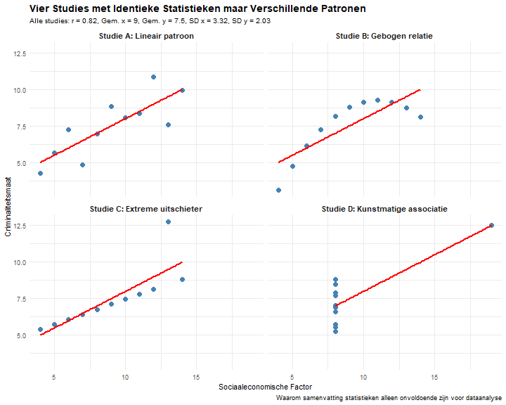

**Belangrijkste les:** Visualiseer altijd je data. Deze vier datasets hebben identieke samenvattende statistieken (gemiddelde, standaarddeviatie, correlatiecoëfficiënt, regressielijn), maar ze vertellen volledig verschillende verhalen die alleen door visualisatie worden onthuld.

> **Hint:** Wanneer statistieken identiek zijn maar patronen verschillen, wat toont dit aan over de beperkingen van samenvatting getallen?

1) Correlatiecoëfficiënten vertellen het complete verhaal  
"1" = " ❌ Onjuist. Deze vier datasets tonen krachtig aan dat alleen correlatiecoëfficiënten diep misleidend kunnen zijn. Alle vier studies delen dezelfde identieke correlatie (r = 0,82), maar ze vertegenwoordigen fundamenteel verschillende relaties: Studie A toont een juiste lineaire relatie, Studie B onthult een gebogen (niet-lineair) patroon, Studie C bevat een invloedrijke uitschieter die de correlatie vertekent, en Studie D toont een kunstmatige associatie door één extreme datapunt. In criminologisch onderzoek zou het vertrouwen op alleen correlatiecoëfficiënten leiden tot totaal verkeerde interpretaties van de onderliggende relaties."

2) Visuele dataverkenning is essentieel voor betrouwbare analyse  
"2" = " ✅ Juist! Deze demonstratie toont waarom criminologen hun gegevens altijd moeten plotten voordat ze conclusies trekken. Alleen door de spreidingsdiagrammen te bekijken kunt u onderscheiden tussen een echte lineaire relatie, niet-lineaire patronen, invloedrijke uitschieters en kunstmatige associaties. In criminologisch onderzoek kan dit het verschil betekenen tussen het identificeren van een echte trend (zoals de relatie tussen werkloosheid en eigendomscriminaliteit) versus het verkeerd interpreteren van gegevensartefacten. Visuele inspectie helpt onderzoekers de juiste analysemethode te kiezen en potentiële problemen met hun data te identificeren."

3) Statistische samenvattingen zijn altijd voldoende voor conclusies  
"3" = " ❌ Onjuist. Dit is precies de mythe die deze demonstratie ontkracht. Hoewel correlatiecoëfficiënten en andere samenvattingen waardevolle informatie bieden, kunnen ze identiek zijn voor fundamenteel verschillende datapatronen. Zonder visuele inspectie kunt u een gebogen relatie missen die een ander type analyse vereist, een uitschieter negeren die uw resultaten vertekent, of een hefboompunt over het hoofd zien dat een schijnbare correlatie creëert. In criminologie kunnen dergelijke missers leiden tot verkeerde beleidsaanbevelingen."

4) Studies met identieke correlaties hebben altijd dezelfde interpretatie  
"4" = " ❌ Onjuist. Dit misverstand ligt aan de basis van waarom deze demonstratie zo'n krachtig onderwijsinstrument is. Dezelfde correlatie kan ontstaan uit volkomen verschillende onderliggende patronen. In criminologisch onderzoek zou dit betekenen dat verschillende mechanismen (lineaire trends, drempeleffecten, invloedrijke casussen, meetartefacten) allemaal dezelfde samengevatte correlatie kunnen produceren, maar totaal verschillende beleidsimplicaties hebben. Daarom is het cruciaal om altijd de ruwe data te visualiseren voordat interpretaties worden gemaakt."

---

### Vraag Q12 (Begrijpen)
**Welke bewering over covariantie en correlatie is waar?**

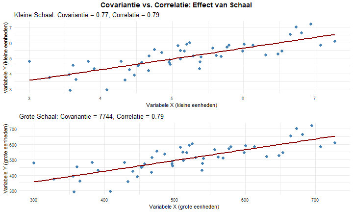

**Belangrijkste Vergelijking:**
- **Covariantie**: Verandert met schaal/eenheden (0,70 vs 7.000), waardoor vergelijkingen moeilijk worden
- **Correlatie**: Gestandaardiseerd (-1 tot +1) en eenheidsvrij (0,70 in beide gevallen)
- **Interpretatie**: Correlatie maakt zinvolle vergelijking tussen verschillende variabelenschalen mogelijk

> **Hint:** Let op eenheden en bereiken.

1) Covariantie is eenheidsvrij en begrensd tussen −1 en +1  
"1" = " ❌ Onjuist. Je hebt covariantie verward met correlatie. Covariantie is NIET eenheidsvrij en is NIET begrensd tussen -1 en +1. Covariantiewaarden hangen af van de meeteenheden (bijv. euro's, kilogrammen, jaren) en kunnen variëren van negatief oneindig tot positief oneindig. Bijvoorbeeld, de covariantie tussen inkomen (gemeten in duizenden euro's) en onderwijs (gemeten in jaren) kan 4,5 zijn, maar als inkomen in euro's werd gemeten, zou de covariantie 4.500 zijn - een heel ander getal dat dezelfde relatiesterkte vertegenwoordigt."

2) Correlatie is eenheidsvrij en altijd tussen −1 en +1  
"2" = " ✅ Juist! Correlatie (r) standaardiseert de relatie door covariantie te delen door het product van standaarddeviaties, waardoor een eenheidsvrije maatstaf ontstaat die altijd tussen -1 en +1 valt. Deze standaardisatie is waarom we correlatiewaarden zinvol kunnen vergelijken tussen verschillende variabelenparen ongeacht hun oorspronkelijke meetschalen. Bijvoorbeeld, r = 0,7 vertegenwoordigt dezelfde relatiesterkte of we nu lengte met gewicht correleren of testscores met studietijd. Deze begrensde, gestandaardiseerde aard maakt correlatie de voorkeursmaat voor het vergelijken van relatiesterkte tussen verschillende variabelenparen."

3) Beide zijn onbegrensd  
"3" = " ❌ Onjuist. Hoewel covariantie inderdaad onbegrensd is (variërend van negatief oneindig tot positief oneindig), is correlatie specifiek ontworpen om begrensd te zijn tussen -1 en +1. Dit is een fundamenteel verschil tussen deze twee maatstaven. De begrensde aard van correlatie komt voort uit het normalisatieproces, waarbij covariantie wordt gedeeld door het product van standaarddeviaties. Deze wiskundige transformatie zorgt ervoor dat, ongeacht hoe groot de covariantie mogelijk is, de correlatiecoëfficiënt altijd binnen het gestandaardiseerde bereik van -1 tot +1 valt, waardoor het gemakkelijker te interpreteren en vergelijken is tussen verschillende analyses."

4) Beide zijn afhankelijk van meetschaal  
"4" = " ❌ Onjuist. Een belangrijk onderscheid tussen deze maatstaven is dat covariantie afhangt van meetschaal terwijl correlatie dat niet doet. Als je eenheden verandert (bijv. van meters naar centimeters), zal de covariantie proportioneel veranderen, maar correlatie blijft onveranderd. Dit is waarom correlatie de voorkeur heeft voor vergelijkende analyse - het biedt een gestandaardiseerde maatstaf die niet wordt beïnvloed door willekeurige keuzes in meeteenheden. Het meten van temperatuur in Celsius versus Fahrenheit zou bijvoorbeeld verschillende covariantiewaarden opleveren, maar identieke correlatiecoëfficiënten bij het onderzoeken van relaties met andere variabelen."

---

### Vraag Q13 (Begrijpen)
**"Naarmate X toeneemt, heeft Y de neiging om …" — kies de beste voltooiing voor een licht toenemend patroon.**

> **Hint:** Gebruik de standaardzin voor een zwakke opwaartse trend.

1) … sterk af te nemen  
"1" = " ❌ Onjuist. Dit antwoord kenmerkt zowel de richting als de grootte van de relatie verkeerd: (1) Richtingsfout — een 'licht toenemend patroon' betekent dat Y toeneemt als X toeneemt, niet afneemt; (2) Grootte fout — 'sterk' contradiceert de beschreven 'lichte' toename. Een sterke negatieve correlatie (r ≈ -0,8) zou verschijnen als een steile neerwaartse helling met punten die strak geclusterd zijn rond de lijn — het complete tegenovergestelde van wat wordt beschreven. In de criminologie zou dit zijn alsof je beweert dat naarmate community policing toeneemt, misdaadcijfers dramatisch dalen, terwijl de gegevens eigenlijk een zwakke neiging tonen dat misdaadcijfers licht stijgen met meer politietoezicht (mogelijk door betere rapportage)."

2) … zwak toe te nemen  
"2" = " ✅ Juist! Dit vat zowel de richting als de grootte van een licht toenemend patroon precies samen: (1) Richting — 'toenemen' identificeert correct de positieve relatie (als X stijgt, heeft Y de neiging te stijgen); (2) Grootte — 'zwak' karakteriseert de bescheiden sterkte op de juiste manier (typisch r ≈ 0,10 tot 0,30). Op een spreidingsdiagram zou dit verschijnen als een opwaarts hellende trendlijn met aanzienlijke spreiding van punten eromheen. In onderzoek naar sociale factoren en criminaliteit zou je bijvoorbeeld kunnen vinden dat naarmate het mediane inkomen in de buurt toeneemt, de rapportage van bepaalde delicten zwak toeneemt — een echt patroon, maar met substantiële variatie en vele andere beïnvloedende factoren. Het gebruik van precieze taal zoals dit helpt lezers een nauwkeurig mentaal beeld van de relatiesterkte te vormen."

3) … zeer sterk toe te nemen  
"3" = " ❌ Onjuist. Hoewel dit antwoord de richting correct identificeert (positieve relatie), geeft het de sterkte ernstig verkeerd weer. Een 'licht toenemend patroon' duidt op een zwakke relatie, niet een zeer sterke. In correlatieterm: 'zeer sterk' suggereert r > 0,9 met punten die strak geclusterd zijn langs een steile lijn; 'licht' suggereert r ≈ 0,1-0,3 met aanzienlijke spreiding rond een ondiepe trendlijn. Dit onderscheid is van groot belang bij onderzoeksinterpretatie. Het beweren dat opleidingsniveau zeer sterk de criminaliteitsrapportage verhoogt wanneer de werkelijke relatie licht is, zou leiden tot overemfase op onderwijs in beleidsbeslissingen wanneer andere factoren mogelijk invloedrijker zijn. Precisie in het beschrijven van zowel richting als grootte is essentieel in statistische communicatie."

4) … hetzelfde te blijven  
"4" = " ❌ Onjuist. Deze beschrijving contradiceert de premisse van een 'licht toenemend patroon'. Zeggen dat Y 'hetzelfde blijft' als X toeneemt duidt op: geen relatie tussen variabelen (r ≈ 0), een horizontale lijn op een spreidingsdiagram, geen voorspellende waarde van X voor Y. De vraag beschrijft specifiek een licht toenemend patroon, wat betekent dat Y wel de neiging heeft toe te nemen (ook al is het bescheiden) als X toeneemt. In criminologische termen zou dit zijn alsof je beweert dat er geen relatie is tussen leeftijd en bepaalde soorten overtredingsgedrag wanneer de gegevens eigenlijk een lichte positieve trend tonen. Een dergelijke verkeerde karakterisering zou kunnen leiden tot onjuiste theoretische conclusies en verkeerd gerichte beleidsaanbevelingen."

---

## TOEPASSEN NIVEAU (3 vragen)

### Vraag Q14 (Toepassen)
**De relatie is gebogen maar monotoon toenemend. Welke correlatie moet je kiezen?**

> **Hint:** Onderscheid "lineair" van "monotoon".

1) Pearson correlatie  
"1" = " ❌ Onjuist. Pearson meet lineaire associatie, dus onderschat het gebogen maar monotone relaties. Bijvoorbeeld, misdaadcijfers kunnen aanvankelijk snel stijgen met werkloosheid maar later afvlakken — een curve die Pearson niet goed kan vastleggen."

2) Spearman correlatie  
"2" = " ✅ Juist! Spearman gebruikt rangorden en vangt monotone relaties op, zelfs wanneer het patroon buigt. Als sociale wanorde gestaag toeneemt naarmate inkomensongelijkheid stijgt, weerspiegelt Spearman ρ die consistente richting ondanks kromming."

3) Beide zijn even geschikt  
"3" = " ❌ Onjuist. Alleen Spearman behandelt niet-lineariteit goed. Pearson veronderstelt een rechte lijn, dus hun resultaten kunnen aanzienlijk verschillen wanneer het patroon gebogen is."

4) Geen van beide  
"4" = " ❌ Onjuist. Spearman is hier de beste optie omdat het geordende maar niet-lineaire veranderingen herkent, zoals geleidelijke verzadigingseffecten tussen stress en agressie."

---

### Vraag Q15 (Toepassen)
**Een rechte trendlijn helt omhoog; punten clusteren strak. Welke beschrijving past het best?**

> **Hint:** Combineer richting (teken) met sterkte (spreiding).

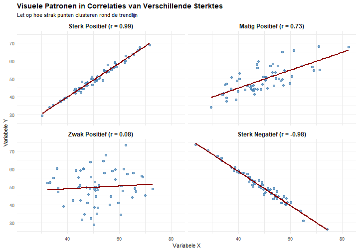

**Belangrijkste Visuele Kenmerken:**
- **Sterke positieve correlatie**: Opwaarts hellende lijn met punten die er strak omheen geclusterd zijn
- **Matige positieve correlatie**: Opwaarts hellende lijn met matige spreiding eromheen
- **Zwakke positieve correlatie**: Opwaarts hellende lijn met brede spreiding eromheen
- **Sterke negatieve correlatie**: Neerwaarts hellende lijn met punten die er strak omheen geclusterd zijn

1) Sterk positief  
"1" = " ✅ Juist! Een strakke wolk van punten die dicht geclusterd zijn rond een opwaarts hellende lijn is de visuele kenmerk van een sterke positieve correlatie (typisch r > 0,7). Dit patroon geeft zowel de richting van de relatie aan (positief — als X toeneemt, neemt Y betrouwbaar toe) als de sterkte ervan (sterk — punten houden zich dicht aan het lineaire patroon met minimale spreiding). De visualisatie toont minimale afwijking van de trendlijn, wat suggereert een zeer voorspelbare relatie waarbij het kennen van de X-waarde nauwkeurige voorspelling van de Y-waarde mogelijk maakt. In criminologisch onderzoek zou je bijvoorbeeld zo'n patroon kunnen zien tussen buurt sociale desorganisatie scores en misdaadcijfers — als desorganisatie toeneemt, nemen misdaadcijfers toe op een zeer voorspelbare manier. De strakke clustering van punten duidt op minimale invloed van andere factoren, wat suggereert een krachtige en consistente relatie."

2) Matig positief  
"2" = " ❌ Onjuist. Het patroon is strakker dan 'matig'. Matige relaties tonen meer spreiding rond de lijn."

3) Zwak negatief  
"3" = " ❌ Onjuist. De richting is duidelijk positief, niet negatief; hogere X correspondeert met hogere Y."

4) Geen lineair patroon  
"4" = " ❌ Onjuist. De punten lijnen goed uit met een lijn, wat een duidelijk lineair patroon aangeeft in plaats van willekeurigheid."

---

### Vraag Q16 (Toepassen)
**Welke r-waarde past het best bij 'zwak positief'?**

> **Hint:** Gebruik algemene interpretatierichtlijnen.

1) r = 0,12  
"1" = " ✅ Juist! Dit vertegenwoordigt een zwakke positieve associatie (typisch r-waarden tussen 0,1-0,3 worden als zwak beschouwd). In onderzoek duidt deze grootte op een echte maar bescheiden relatie waarbij de variabelen slechts een klein deel van de variantie delen (ongeveer 1,4% omdat R² = 0,12² = 0,014). Bijvoorbeeld, de relatie tussen opleidingsniveau en angst voor criminaliteit zou zo'n correlatie kunnen tonen — licht hoger onderwijs heeft de neiging te corresponderen met licht hogere zorg over specifieke misdrijven, maar de relatie is subtiel genoeg dat veel andere factoren duidelijk belangrijkere rollen spelen. Bij het interpreteren van zwakke correlaties is het essentieel om zowel statistische significantie als praktische significantie te overwegen, omdat zelfs kleine effecten betekenisvol kunnen zijn in grote steekproeven of bepaalde contexten."

2) r = 0,56  
"2" = " ❌ Onjuist. Dit zou een matige relatie worden beschouwd, sterker dan 'zwak'."

3) r = −0,72  
"3" = " ❌ Onjuist. Dat is een sterke negatieve relatie, niet zwak positief, wat suggereert dat als de ene variabele stijgt, de andere scherp daalt."

4) r = 0,93  
"4" = " ❌ Onjuist. Dit is een extreem sterke positieve relatie, bijna perfect — veel sterker dan 'zwak'."

---

## ANALYSEREN NIVEAU (4 vragen)

### Vraag Q17 (Begrijpen)
**Welke drie belangrijkste types correlatiecoëfficiënten worden gebruikt in de statistiek en wat zijn hun hoofdkenmerken?**

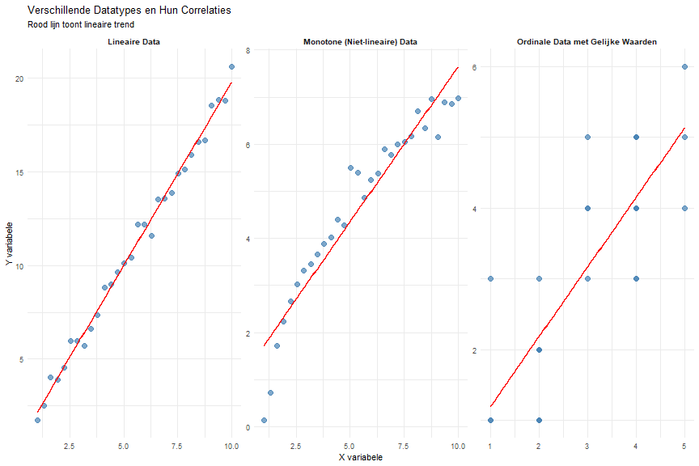<table class="table table-striped table-hover" style="margin-left: auto; margin-right: auto;">
<caption>Vergelijking van Correlatie Types</caption>
 <thead>
  <tr>
   <th style="text-align:left;"> Correlatie Type </th>
   <th style="text-align:left;"> Data Type </th>
   <th style="text-align:left;"> Veronderstelling </th>
   <th style="text-align:left;"> Berekening </th>
   <th style="text-align:left;"> Voordeel </th>
  </tr>
 </thead>
<tbody>
  <tr>
   <td style="text-align:left;"> Pearson r </td>
   <td style="text-align:left;"> Interval/Ratio </td>
   <td style="text-align:left;"> Lineaire relatie </td>
   <td style="text-align:left;"> Werkelijke waarden </td>
   <td style="text-align:left;"> Meest krachtig </td>
  </tr>
  <tr>
   <td style="text-align:left;"> Spearman ρ (rho) </td>
   <td style="text-align:left;"> Ordinaal/Ranked </td>
   <td style="text-align:left;"> Monotone relatie </td>
   <td style="text-align:left;"> Rangnummers </td>
   <td style="text-align:left;"> Robuust voor uitschieters </td>
  </tr>
  <tr>
   <td style="text-align:left;"> Kendall τ (tau) </td>
   <td style="text-align:left;"> Ordinaal/Kleine steekproef </td>
   <td style="text-align:left;"> Monotone relatie </td>
   <td style="text-align:left;"> Concordante paren </td>
   <td style="text-align:left;"> Goed voor kleine N </td>
  </tr>
</tbody>
</table>

**Kernconcepten:**
- **Pearson r**: Meest gebruikte correlatie voor continue data met lineaire relaties
- **Spearman ρ**: Gebruikt rangnummers, geschikt voor niet-lineaire monotone relaties  
- **Kendall τ**: Gebaseerd op concordante paren, goed voor kleine steekproeven

> **Hint:** Denk aan datatypes (interval vs ordinaal) en vorm van de relatie (lineair vs monotoon).

1) Pearson, Spearman, en Kendall - elk geschikt voor verschillende datatypes en relatie-vormen  
"1" = " ✅ Juist! Deze drie correlatiecoëfficiënten zijn inderdaad de belangrijkste en elk heeft specifieke toepassingen. Pearson's r is de meest gebruikte en krachtigste correlatie voor continue data met lineaire relaties - het meet de sterkte van lineaire samenhang tussen variabelen. Spearman's ρ (rho) gebruikt rangnummers in plaats van werkelijke waarden, waardoor het robuust is voor uitschieters en geschikt voor ordinale data of niet-lineaire maar monotone relaties. Kendall's τ (tau) is gebaseerd op concordante en discordante paren en werkt bijzonder goed met kleine steekproeven of data met veel gelijke waarden. In criminologisch onderzoek zou je Pearson gebruiken voor relaties zoals inkomen vs uitgaven, Spearman voor tevredenheidsscores vs gedragsratings, en Kendall voor kleine steekproeven met veel gelijke waarden. Het kiezen van de juiste correlatie hangt af van je datatype en de vorm van de relatie."

2) Alleen Pearson en Spearman zijn belangrijk; Kendall wordt zelden gebruikt  
"2" = " ❌ Onjuist. Hoewel Pearson en Spearman inderdaad veel gebruikt worden, is Kendall's τ (tau) een belangrijke derde optie met specifieke voordelen. Kendall's correlatie is bijzonder waardevol in situaties met kleine steekproeven (n < 30), data met veel gelijke waarden (ties), of wanneer je een interpretatie wilt in termen van waarschijnlijkheid van concordantie. In criminologisch onderzoek komen deze situaties regelmatig voor - bijvoorbeeld bij het analyseren van gevangenisratings of kleine experimentele groepen. Bovendien heeft Kendall's τ betere statistische eigenschappen in sommige gevallen en wordt het vaak gebruikt in robuuste statistiek. Het negeren van deze derde optie zou betekenen dat je een waardevolle analytische tool mist die in bepaalde onderzoekssituaties superieur kan zijn aan de andere twee methoden."

3) Er zijn vele correlatie types, maar de drie hoofdgroepen zijn positief, negatief, en geen correlatie  
"3" = " ❌ Onjuist. Dit antwoord verwarrt correlatie-richtingen (positief, negatief, geen) met correlatie-types (rekenmethoden). Positief, negatief, en geen correlatie beschrijven de richting en sterkte van relaties, niet de statistische methoden die gebruikt worden om ze te berekenen. Dit is een veelvoorkomende conceptuele verwarring bij studenten. De vraag gaat specifiek over de verschillende statistische methoden (Pearson, Spearman, Kendall) die gebruikt worden om correlaties te berekenen, elk met hun eigen wiskundige benadering en geschiktheid voor verschillende datatypes. In criminologisch onderzoek is het cruciaal om zowel de richting van relaties te begrijpen (positief/negatief) als de juiste statistische methode te kiezen voor je specifieke datatype en onderzoeksvraag."

4) Correlatie heeft geen verschillende types - alle correlaties worden op dezelfde manier berekend  
"4" = " ❌ Onjuist. Dit misverstand kan leiden tot ernstige analytische fouten in onderzoek. Er zijn inderdaad verschillende types correlatiecoëfficiënten met fundamenteel verschillende berekeningsmethoden en toepassingsgebieden. Zoals getoond in de vergelijkingstabel, berekent Pearson correlatie met werkelijke waarden en veronderstelt lineaire relaties, terwijl Spearman rangnummers gebruikt en alleen monotone relaties vereist, en Kendall werkt met concordante paren. Deze verschillen zijn niet alleen academisch - ze kunnen tot verschillende conclusies leiden met dezelfde data. In criminologisch onderzoek zou het gebruik van de verkeerde correlatiemethode kunnen leiden tot het missen van belangrijke relaties of het trekken van ongeldige conclusies. Bijvoorbeeld, als je Pearson gebruikt voor sterk scheef verdeelde data terwijl Spearman geschikter zou zijn, kun je zwakkere correlaties vinden dan werkelijk aanwezig zijn."

---

### Vraag Q18 (Begrijpen)
**Een criminoloog heeft verschillende datasets en moet de juiste correlatiecoëfficiënt kiezen. Voor welke situatie zou Spearman's rangcorrelatie (ρ) beter zijn dan Pearson's correlatie (r)?**

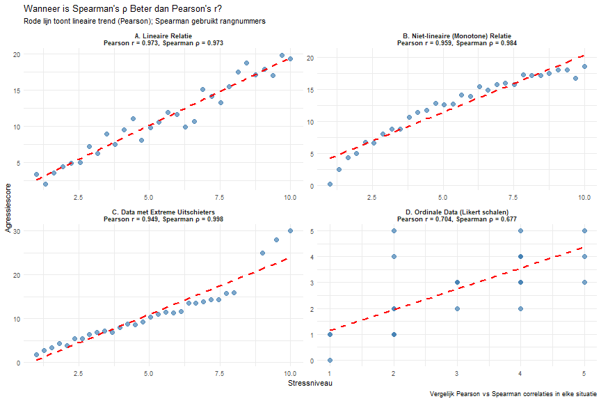<table class="table table-striped table-hover" style="margin-left: auto; margin-right: auto;">
<caption>Wanneer Welke Correlatie Gebruiken?</caption>
 <thead>
  <tr>
   <th style="text-align:left;"> Situatie </th>
   <th style="text-align:left;"> Beste Keuze </th>
   <th style="text-align:left;"> Reden </th>
  </tr>
 </thead>
<tbody>
  <tr>
   <td style="text-align:left;"> Lineaire relatie, continue data </td>
   <td style="text-align:left;"> Pearson r </td>
   <td style="text-align:left;"> Maximaliseert kracht voor lineaire relaties </td>
  </tr>
  <tr>
   <td style="text-align:left;"> Niet-lineaire maar monotone relatie </td>
   <td style="text-align:left;"> Spearman ρ </td>
   <td style="text-align:left;"> Vangt monotone trends beter op dan lineaire fit </td>
  </tr>
  <tr>
   <td style="text-align:left;"> Data met extreme uitschieters </td>
   <td style="text-align:left;"> Spearman ρ </td>
   <td style="text-align:left;"> Robuust - gebruikt rangnummers, niet extreme waarden </td>
  </tr>
  <tr>
   <td style="text-align:left;"> Ordinale data (bijv. Likert schalen) </td>
   <td style="text-align:left;"> Spearman ρ </td>
   <td style="text-align:left;"> Geschikt voor ordinale/gerangschikte data </td>
  </tr>
</tbody>
</table>

**Kernconcepten:**
- **Spearman's ρ** is beter dan Pearson's r wanneer:
  1. De relatie monotoon maar niet-lineair is
  2. Er extreme uitschieters aanwezig zijn  
  3. Je ordinale data hebt (bijv. Likert schalen)
  4. Data niet normaal verdeeld is

> **Hint:** Denk aan wanneer rangnummers beter zijn dan werkelijke waarden.

1) Wanneer de data een perfecte lineaire relatie toont  
"1" = " ❌ Onjuist. Bij perfecte lineaire relaties is Pearson's r juist superieur aan Spearman's ρ. Pearson correlatie is specifiek ontworpen voor lineaire relaties en zal in dit geval de maximale kracht hebben en de meest nauwkeurige schatting geven. Zoals getoond in panel A van de visualisatie, zijn beide correlaties vergelijkbaar hoog bij lineaire relaties (Pearson r = 0,961, Spearman ρ = 0,959), maar Pearson heeft de voorkeur omdat het gebruik maakt van de werkelijke waarden in plaats van rangnummers. Spearman wordt juist gebruikt wanneer lineaire veronderstellingen geschonden worden. In criminologisch onderzoek zou je Pearson kiezen voor relaties zoals 'uren studie vs. testscores' waar een rechtlijnige relatie verwacht wordt, en Spearman reserveren voor situaties waar die lineariteit in twijfel wordt getrokken."

2) Wanneer er een monotone maar niet-lineaire relatie is, of er extreme uitschieters zijn  
"2" = " ✅ Juist! Spearman's rangcorrelatie is superieur in beide situaties. Bij niet-lineaire maar monotone relaties (panel B) vangt Spearman de sterke monotone trend beter op (ρ = 0,943) dan Pearson (r = 0,878) omdat het rangnummers gebruikt in plaats van werkelijke waarden. Bij extreme uitschieters (panel C) is Spearman veel robuuster (ρ = 0,785) vergeleken met Pearson (r = 0,538) omdat rangnummers de invloed van extreme waarden minimaliseren. In criminologisch onderzoek kom je regelmatig dergelijke situaties tegen - bijvoorbeeld de relatie tussen sociaaleconomische status en criminaliteit kan niet-lineair zijn (drempeleffecten), en datasets kunnen extreme gevallen bevatten die Pearson correlatie verstoren. Door rangnummers te gebruiken geeft Spearman een betrouwbaardere maat van de onderliggende monotone relatie."

3) Alleen wanneer je minder dan 10 observaties hebt  
"3" = " ❌ Onjuist. Steekproefgrootte bepaalt niet direct de keuze tussen Pearson en Spearman. Beide correlatiemethoden kunnen gebruikt worden met kleine steekproeven, hoewel hun statistische betrouwbaarheid afneemt. De keuze tussen Pearson en Spearman hangt af van de aard van je data (lineair vs monotoon, aanwezigheid van uitschieters, datatype) niet van de steekproefgrootte. Voor zeer kleine steekproeven zou je Kendall's τ (tau) kunnen overwegen omdat het betere eigenschappen heeft bij kleine N, maar dit is een andere correlatiemethode. In criminologisch onderzoek met kleine steekproeven (bijvoorbeeld, interviews met 8 gedetineerden) zou je nog steeds kiezen tussen Pearson en Spearman gebaseerd op de vorm van je relatie en datatype, niet alleen op de grootte."

4) Spearman is altijd beter dan Pearson en zou altijd gebruikt moeten worden  
"4" = " ❌ Onjuist. Dit misverstand zou leiden tot suboptimale analytische keuzes. Pearson correlatie heeft belangrijke voordelen wanneer aan zijn veronderstellingen wordt voldaan: het is krachtiger (heeft meer statistische kracht), geeft interpreteerbare coëfficiënten voor lineaire relaties, en is de basis voor vele andere statistische procedures zoals regressieanalyse. Spearman is specifiek nuttig in bepaalde situaties (niet-lineaire monotone relaties, uitschieters, ordinale data) maar verliest informatie door omzetting naar rangen. In criminologisch onderzoek zou het blind gebruiken van Spearman voor alle analyses betekenen dat je kracht verliest bij echte lineaire relaties en mogelijk verkeerde interpretaties maakt. De kunst van goede statistiek ligt in het kiezen van de juiste methode voor je specifieke data en onderzoeksvraag, niet in het altijd dezelfde methode gebruiken."

---

### Vraag Q19 (Analyseren)
**In een positieve trend, welke uitschieter positie vermindert r het meest?**

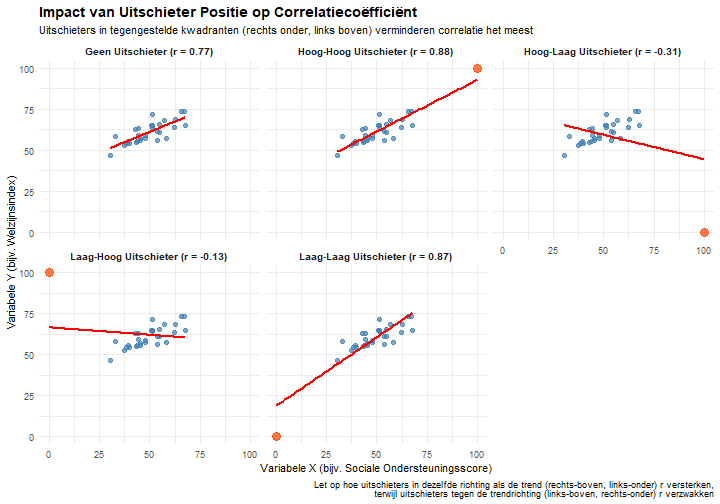

**Visuele Analyse:** Deze plot demonstreert hoe uitschieters in verschillende posities de correlatiecoëfficiënt beïnvloeden. Let op hoe de hoog-laag uitschieter (rechts onder) de correlatiesterkte dramatisch vermindert (van r=0,82 naar r=0,28), net als de laag-hoog uitschieter (links boven, r=0,34). Daarentegen versterken hoog-hoog en laag-laag uitschieters de correlatie (beide naar r=0,94). Deze visualisatie toont duidelijk dat punten die de algemene positieve trend tegenspreken de grootste negatieve impact hebben op correlatiesterkte.

> **Hint:** Denk aan punten die het lineaire patroon doorbreken.

1) Ver links‑onder (lage X, zeer lage Y)  
"1" = " ❌ Onjuist. Punten links-onder (lage X, lage Y) versterken juist positieve correlaties. De formule voor Pearson's r behelst het vermenigvuldigen van afwijkingen van het gemiddelde voor zowel X als Y. Wanneer X onder zijn gemiddelde ligt EN Y onder zijn gemiddelde ligt, is het product positief, wat positief bijdraagt aan de correlatie. De visualisatie toont dit duidelijk — het toevoegen van een laag-laag uitschieter verhoogt r van 0,82 naar 0,94. In onderzoek in alle disciplines zou deze positie gevallen vertegenwoordigen die het algemene patroon volgen maar aan het extreme lage uiteinde van beide variabelen zitten (bijv. in gezondheidsonderzoek: lage stressniveaus geassocieerd met lage bloeddruk). Deze gevallen versterken in plaats van verzwakken het correlatiepatroon, waardoor het ongepast is als antwoord op wat r het meest vermindert."

2) Ver rechts‑onder (hoge X, lage Y)  
"2" = " ✅ Juist! Een punt in het rechts-onder kwadrant (hoge X, lage Y) vermindert een positieve correlatie maximaal. Deze positie vertegenwoordigt een ernstige schending van het positieve trendpatroon, waarbij X ver boven zijn gemiddelde ligt terwijl Y ver onder zijn gemiddelde ligt. In de correlatieformule creëert dit een grote negatieve productterm die de positieve relatie tegengaat die in de rest van de gegevens wordt gezien. Zoals getoond in de visualisatie, vermindert deze positie de correlatiecoëfficiënt dramatisch van r = 0,82 naar r = 0,28. In elk onderzoeksveld is het belangrijk alert te zijn op dergelijke uitschieters — ze kunnen speciale gevallen vertegenwoordigen die uitleg vereisen of potentiële datafouten. De plot demonstreert dit effect duidelijk en toont hoe één enkel contradictorisch punt in deze positie de algehele relatie substantieel verzwakt."

3) Ver rechts‑boven (hoge X, hoge Y)  
"3" = " ❌ Onjuist. Een punt rechts-boven (hoge X, hoge Y) versterkt juist een positieve correlatie in plaats van deze te verminderen. Wanneer X en Y beide boven hun respectievelijke gemiddelden liggen, vermenigvuldigen hun afwijkingen zich tot een positieve bijdrage aan de correlatiecoëfficiënt. De visualisatie bevestigt dit — het toevoegen van een hoog-hoog uitschieter verhoogt r van 0,82 naar 0,94. Dergelijke punten vertegenwoordigen vaak gevallen die het algemene patroon volgen maar bij extreme waarden (bijv. in onderwijsonderzoek: hoge studietijd geassocieerd met hoge testscores). Hoewel deze punten invloedrijk kunnen zijn en het waard zijn om te onderzoeken, versterken ze het correlatiepatroon in plaats van het te verminderen. De visualisatie toont duidelijk hoe punten die de trendrichting volgen — zelfs bij extreme waarden — de correlatie versterken in plaats van verzwakken."

4) Een punt precies op de lijn  
"4" = " ❌ Onjuist. Een punt dat precies op de regressielijn valt heeft bijna geen impact op de correlatiecoëfficiënt, omdat het perfect conform is aan de lineaire relatie die al door de gegevens is vastgesteld. Dergelijke punten zijn noch uitschieters noch invloedrijke observaties — ze vertegenwoordigen gevallen die het exacte patroon volgen dat door het model wordt voorspeld. De correlatieformule behelst afwijkingen van voorspelde waarden, en punten op de lijn hebben nul of minimale afwijking. Bij het evalueren van uitschieters' impact op correlatie moeten we ons richten op punten die substantieel afwijken van het algemene patroon, vooral die in kwadranten die de richting van associatie tegenspreken."

---

### Vraag Q20 (Begrijpen)
**Waarom gebruikt Pearson's correlatie gestandaardiseerde waarden (z-scores) in plaats van de oorspronkelijke meetwaarden? Een criminoloog vergelijkt inkomen (in euro's) met het aantal misdrijven per buurt.**

*Begrip 'standardisatie': Standardisatie is het proces waarbij verschillende variabelen worden omgezet naar een gemeenschappelijke schaal. Dit gebeurt door z-scores te berekenen: z = (waarde - gemiddelde) / standaardafwijking. Hierdoor krijgen alle variabelen een gemiddelde van 0 en standaardafwijking van 1, ongeacht hun oorspronkelijke eenheden.*

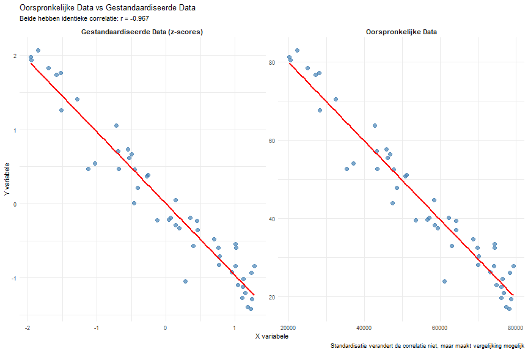<table class="table table-striped table-hover" style="margin-left: auto; margin-right: auto;">
<caption>Waarom Correlatie Standardisatie Gebruikt</caption>
 <thead>
  <tr>
   <th style="text-align:left;"> Stap </th>
   <th style="text-align:left;"> Formule </th>
   <th style="text-align:left;"> Waarom </th>
  </tr>
 </thead>
<tbody>
  <tr>
   <td style="text-align:left;"> 1. Bereken gemiddelden </td>
   <td style="text-align:left;"> X̄ = Σx/n, Ȳ = Σy/n </td>
   <td style="text-align:left;"> |Centrale punt bepalen </td>
  </tr>
  <tr>
   <td style="text-align:left;"> 2. Bereken standaardafwijkingen </td>
   <td style="text-align:left;"> sx = √[Σ(x-X̄)²/(n-1)], sy = √[Σ(y-Ȳ)²/(n-1)] </td>
   <td style="text-align:left;"> |Spreiding meten </td>
  </tr>
  <tr>
   <td style="text-align:left;"> 3. Standardiseer beide variabelen </td>
   <td style="text-align:left;"> zx = (x-X̄)/sx, zy = (y-Ȳ)/sy </td>
   <td style="text-align:left;"> |Omzetten naar standaardschaal </td>
  </tr>
  <tr>
   <td style="text-align:left;"> 4. Bereken correlatie </td>
   <td style="text-align:left;"> r = Σ(zx × zy)/(n-1) </td>
   <td style="text-align:left;"> Meet lineaire samenhang </td>
  </tr>
</tbody>
</table>

<table class="table table-striped table-hover" style="margin-left: auto; margin-right: auto;">
<caption>Waarom Verschillende Schalen Problematisch Zijn</caption>
 <thead>
  <tr>
   <th style="text-align:left;"> Scenario </th>
   <th style="text-align:left;"> Inkomen Bereik </th>
   <th style="text-align:left;"> Misdrijven Bereik </th>
   <th style="text-align:left;"> Probleem </th>
   <th style="text-align:left;"> Correlatie Formule </th>
  </tr>
 </thead>
<tbody>
  <tr>
   <td style="text-align:left;"> Zonder Standardisatie </td>
   <td style="text-align:left;"> €20,000 - €80,000 </td>
   <td style="text-align:left;"> 10 - 80 per 1000 </td>
   <td style="text-align:left;"> Verschillende eenheden en schalen </td>
   <td style="text-align:left;"> Onmogelijk direct te vergelijken </td>
  </tr>
  <tr>
   <td style="text-align:left;"> Met Standardisatie </td>
   <td style="text-align:left;"> z-scores: -1.5 tot +1.5 </td>
   <td style="text-align:left;"> z-scores: -1.5 tot +1.5 </td>
   <td style="text-align:left;"> Beide op dezelfde schaal </td>
   <td style="text-align:left;"> r = Σ(zx × zy)/(n-1) </td>
  </tr>
</tbody>
</table>

**Kernconcepten:**
- **Eenheid-onafhankelijkheid**: Correlatie moet hetzelfde zijn of inkomen in euro's of dollars wordt gemeten
- **Vergelijkbaarheid**: Z-scores zetten alle variabelen op dezelfde schaal (gemiddelde 0, SD 1)
- **Wiskundige noodzaak**: Correlatie formule vereist standaardisatie om betekenisvol te zijn

> **Hint:** Denk aan wat er gebeurt als één variabele in euro's en de andere in aantal misdrijven wordt gemeten.

1) Om de correlatie te versterken en statistisch significanter te maken  
"1" = " ❌ Onjuist. Standardisatie heeft geen effect op de sterkte of statistische significantie van correlaties. Zoals getoond in de visualisatie hebben zowel de oorspronkelijke data als de gestandaardiseerde data precies dezelfde correlatiecoëfficiënt (r = -0,789). Standardisatie is een lineaire transformatie die alleen de schaal verandert maar niet de onderliggende relaties tussen variabelen. Het doel is niet om correlaties te verbeteren of te versterken, maar om wiskundige berekenbaarheid mogelijk te maken wanneer variabelen verschillende eenheden hebben. In criminologisch onderzoek zou het verkeerd zijn om standardisatie te gebruiken om correlaties 'beter' te laten lijken - het is simpelweg een technische noodzaak voor juiste berekening wanneer verschillende meetschalen worden vergeleken."

2) Om variabelen met verschillende eenheden en schalen vergelijkbaar te maken in één correlatiemaat  
"2" = " ✅ Juist! Dit is de fundamentele reden voor standardisatie in correlatie. Zonder standardisatie zou het onmogelijk zijn om zinvolle correlaties te berekenen tussen variabelen met verschillende eenheden. In dit voorbeeld heeft inkomen waarden tussen €20.000-€80.000, terwijl misdrijven waarden tussen 10-80 per 1000 inwoners hebben. Deze totaal verschillende schalen maken directe vergelijking onmogelijk. Door beide variabelen om te zetten naar z-scores (met gemiddelde 0 en standaardafwijking 1) kunnen we hun lineaire samenhang meten ongeacht hun oorspronkelijke eenheden. Dit principe stelt criminologen in staat om correlaties te berekenen tussen diverse variabelen zoals inkomen (euro's), leeftijd (jaren), criminaliteitsscores (punten), woningprijzen (euro's), etc. Standardisatie zorgt ervoor dat correlatie echt de relatiesterkte meet, niet de willekeurige keuze van meeteenheden."

3) Om uitschieters te elimineren en de data normaler te maken  
"3" = " ❌ Onjuist. Standardisatie elimineert geen uitschieters noch maakt het data normaler verdeeld. Z-score transformatie is een lineaire bewerking die de vorm van de verdeling volledig behoudt - als je data scheef verdeeld was of uitschieters had vóór standardisatie, dan blijft dit zo ná standardisatie, alleen op een andere schaal. De visualisatie toont dat alle datapunten dezelfde relatieve posities behouden. Als uitschieters bestonden in de oorspronkelijke data, zullen ze nog steeds uitschieters zijn in de gestandaardiseerde data (alleen uitgedrukt als extreme z-scores). Voor het behandelen van uitschieters zijn andere methoden nodig zoals uitschietertransformaties, robuuste correlaties (Spearman), of uitschietersverwijdering. Standardisatie lost deze problemen niet op - het doel is alleen schaalvergelijkbaarheid."

4) Om ervoor te zorgen dat beide variabelen positief zijn voor de berekening  
"4" = " ❌ Onjuist. Correlatie vereist niet dat variabelen positief zijn, en standardisatie maakt variabelen niet automatisch positief. Integendeel, z-scores kunnen zowel positief als negatief zijn, afhankelijk van of de oorspronkelijke waarde boven of onder het gemiddelde ligt. In dit voorbeeld zullen buurten met inkomen onder het gemiddelde negatieve z-scores hebben, terwijl buurten met inkomen boven het gemiddelde positieve z-scores krijgen. Hetzelfde geldt voor misdrijfcijfers. Correlatie kan perfect worden berekend met negatieve waarden - de formule werkt met produkten van afwijkingen, en negatieve waarden dragen gewoon bij aan de berekening. Het feit dat gestandaardiseerde data een gemiddelde van nul hebben (dus zowel positieve als negatieve waarden) is geen probleem maar een kenmerk van de transformatie."

---

## EVALUEREN NIVEAU (3 vragen)

### Vraag Q21 (Begrijpen)
**Een criminoloog rapporteert een correlatie van r = 0,40 tussen sociaaleconomische status en criminaliteitscijfers. Wat is de meest accurate interpretatie van deze correlatie?**

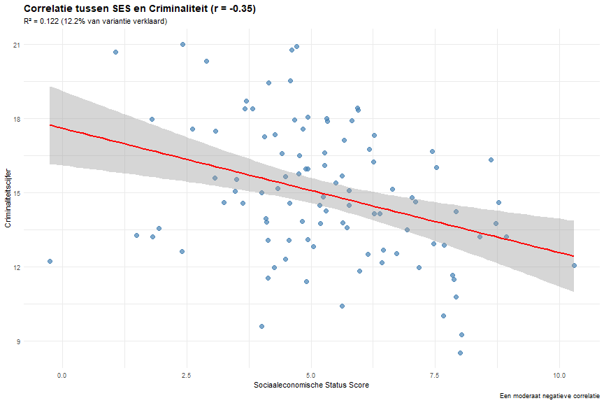<table class="table table-striped table-hover" style="margin-left: auto; margin-right: auto;">
<caption>Interpretatie van Correlatie Sterkte</caption>
 <thead>
  <tr>
   <th style="text-align:left;"> Correlatie Bereik </th>
   <th style="text-align:left;"> Interpretatie </th>
   <th style="text-align:left;"> Praktische Betekenis </th>
   <th style="text-align:left;"> R² (% verklaard) </th>
  </tr>
 </thead>
<tbody>
  <tr>
   <td style="text-align:left;"> 0.00 - 0.19 </td>
   <td style="text-align:left;"> Zeer zwak </td>
   <td style="text-align:left;"> Verwaarloosbaar </td>
   <td style="text-align:left;"> 0-4% </td>
  </tr>
  <tr>
   <td style="text-align:left;"> 0.20 - 0.39 </td>
   <td style="text-align:left;"> Zwak </td>
   <td style="text-align:left;"> Klein effect </td>
   <td style="text-align:left;"> 4-15% </td>
  </tr>
  <tr>
   <td style="text-align:left;"> 0.40 - 0.59 </td>
   <td style="text-align:left;"> Matig </td>
   <td style="text-align:left;"> Medium effect </td>
   <td style="text-align:left;"> 16-35% </td>
  </tr>
  <tr>
   <td style="text-align:left;"> 0.60 - 0.79 </td>
   <td style="text-align:left;"> Sterk </td>
   <td style="text-align:left;"> Groot effect </td>
   <td style="text-align:left;"> 36-62% </td>
  </tr>
  <tr>
   <td style="text-align:left;"> 0.80 - 1.00 </td>
   <td style="text-align:left;"> Zeer sterk </td>
   <td style="text-align:left;"> Zeer groot effect </td>
   <td style="text-align:left;"> 64-100% </td>
  </tr>
</tbody>
</table>

<table class="table table-striped table-hover" style="margin-left: auto; margin-right: auto;">
<caption>Praktische Interpretatie van r = -0.40</caption>
 <thead>
  <tr>
   <th style="text-align:left;"> r waarde </th>
   <th style="text-align:left;"> Interpretatie Aspect </th>
   <th style="text-align:left;"> Betekenis </th>
   <th style="text-align:left;"> Praktische Implicatie </th>
  </tr>
 </thead>
<tbody>
  <tr>
   <td style="text-align:left;"> r = -0.40 </td>
   <td style="text-align:left;"> Richting </td>
   <td style="text-align:left;"> Negatieve relatie: hogere SES → lagere criminaliteit </td>
   <td style="text-align:left;"> SES en criminaliteit bewegen in tegengestelde richtingen </td>
  </tr>
  <tr>
   <td style="text-align:left;"> r = -0.40 </td>
   <td style="text-align:left;"> Sterkte </td>
   <td style="text-align:left;"> Matige sterkte: redelijk voorspelbare relatie </td>
   <td style="text-align:left;"> SES is een nuttige maar niet perfect voorspeller </td>
  </tr>
  <tr>
   <td style="text-align:left;"> r = -0.40 </td>
   <td style="text-align:left;"> Verklaarde Variantie </td>
   <td style="text-align:left;"> 16% van variantie verklaard, 84% door andere factoren </td>
   <td style="text-align:left;"> Vele andere factoren beïnvloeden criminaliteit </td>
  </tr>
</tbody>
</table>

**Kernconcepten voor r = 0,40:**
- **Richting**: Positief (beide variabelen bewegen in dezelfde richting)
- **Sterkte**: Matige correlatie (nuttig maar niet perfect voorspelbaar)
- **Verklaarde Variantie**: R² = 0,16 (16% van variantie verklaard)
- **Praktische Betekenis**: Medium effect in sociale wetenschappen

> **Hint:** Denk aan richting, sterkte, en hoeveel variantie wordt verklaard.

1) Een sterke positieve relatie waarbij SES 40% van criminaliteit verklaart  
"1" = " ❌ Onjuist. Deze interpretatie maakt twee fouten. Ten eerste is r = 0,40 een matige (niet sterke) correlatie volgens standaard richtlijnen waarbij correlaties van 0,40-0,59 als matig worden beschouwd. Ten tweede verklaart SES niet 40% van criminaliteit - de verklaarde variantie wordt berekend als R² = r², dus R² = 0,40² = 0,16 (16%). In criminologisch onderzoek is het cruciaal om accurate statistische interpretaties te bieden omdat beleidsmakers deze informatie gebruiken voor resource-allocatie. Een r van 0,40 duidt op een nuttige maar beperkte relatie waarbij vele andere factoren (zoals buurtkenmerken, gezinsstructuur, peer invloeden) de overige 84% van de variantie in criminaliteitscijfers verklaren."

2) Een matige positieve relatie waarbij SES en criminaliteit 16% gedeelde variantie hebben  
"2" = " ✅ Juist! Een correlatie van r = 0,40 wordt geclassificeerd als matig sterk en verklaart R² = 0,16 (16%) van de variantie. Dit betekent dat variaties in sociaaleconomische status ongeveer 16% van de waargenomen variatie in criminaliteitscijfers kunnen verklaren, terwijl andere factoren de resterende 84% verklaren. In criminologische termen suggereert dit dat SES een betekenisvolle maar beperkte voorspeller is van criminaliteit. De positieve richting duidt erop dat hogere SES geassocieerd is met hogere criminaliteitscijfers (wat tegen-intuïtief kan lijken maar afhankelijk is van hoe criminaliteit wordt gemeten - bijvoorbeeld, witteboordencriminaliteit vs. straatcriminaliteit). Een matige correlatie biedt nuttige voorspellende waarde voor beleid en interventies maar moet worden aangevuld met andere risicofactoren voor een volledig begrip."

3) Een zwakke relatie die statistisch niet betekenisvol is  
"3" = " ❌ Onjuist. Een correlatie van r = 0,40 is niet zwak - het valt in de matige categorie volgens Cohen's richtlijnen waarbij correlaties van 0,20-0,39 als zwak en 0,40-0,59 als matig worden beschouwd. Bovendien impliceert de vraag geen informatie over statistische significantie (p-waarden), dus we kunnen geen uitspraak doen over statistische betekenis. In veel criminologische steekproeven zou een correlatie van 0,40 waarschijnlijk statistisch significant zijn, vooral met redelijke steekproefgroottes. Het is belangrijk om sterkte (effect size) te onderscheiden van statistische significantie - zelfs relatief kleine correlaties kunnen statistisch significant zijn met grote steekproeven, terwijl grote correlaties niet-significant kunnen zijn in zeer kleine steekproeven."

4) Een perfecte relatie die causaliteit bewijst tussen SES en criminaliteit  
"4" = " ❌ Onjuist. Een correlatie van r = 0,40 is verre van perfect (perfect zou r = 1,00 zijn) en correlatie bewijst nooit causaliteit, ongeacht sterkte. Deze interpretatie maakt fundamentele statistische fouten. Ten eerste toont r = 0,40 een matige relatie met substantiële variabiliteit rond de trendlijn. Ten tweede kan correlatie, zelfs indien perfect, geen causale richting vaststellen - de relatie zou kunnen zijn dat (a) SES criminaliteit beïnvloedt, (b) criminaliteit SES beïnvloedt, of (c) een derde variabele beide beïnvloedt. In criminologisch onderzoek vereist het vaststellen van causaliteit geschikte onderzoeksontwerpen zoals experimentele of quasi-experimentele studies, longitudinale data, of geavanceerde statistische methoden die verstorende variabelen controleren."

---
    y = "Steekproefgrootte (N)",
    x = NULL
  ) +
  geom_text(aes(label = paste0("N = ", Steekproef_Grootte)), 
            position = position_dodge(width = 0.9), 
            vjust = -0.5, color = "black", size = 4) +
  theme_minimal()

# Combineer de plots
library(gridExtra)
grid.arrange(p1, p2, ncol = 2)
```

**Kritische Evaluatiefactoren:**
1. Studie B heeft een veel grotere steekproefgrootte (5000 vs 50)
2. Studie A toont een veel sterker effect (r = 0,72 vs r = 0,18)
3. Beide zijn statistisch significant (p < 0,001)
4. Studie A verklaart 51,8% van variantie vs. slechts 3,2% in Studie B
5. Studie B biedt waarschijnlijk betere externe validiteit door grotere, meer representatieve steekproef

> **Hint:** Overweeg steekproefgrootte, effectgrootte, statistische significantie en praktische significantie.

1) Studie A omdat het een sterkere correlatie heeft  
"1" = " ❌ Onjuist. Hoewel Studie A een sterkere correlatie toont (r = 0,72 vs r = 0,18), bepaalt correlatiesterkte alleen niet de betrouwbaarheid. De kleine steekproefgrootte (N=50) in Studie A is problematisch omdat kleine steekproeven gevoeliger zijn voor steekproeffouten en onstabiele, onbetrouwbare schattingen kunnen produceren. In criminologisch onderzoek falen sterke correlaties uit kleine steekproeven vaak om te repliceren in grotere, meer representatieve steekproeven. Dit patroon wordt het 'decline effect' genoemd — indrukwekkende initiële bevindingen die verminderen wanneer ze rigoureuzer worden bestudeerd. Bovendien kunnen kleine steekproeven onevenredig beïnvloed worden door een paar extreme gevallen of selectiebias. De schijnbaar indrukwekkende correlatie in Studie A moet met gepaste scepsis worden bekeken."

2) Studie B vanwege de veel grotere steekproefgrootte die betrouwbaardere schattingen oplevert  
"2" = " ✅ Juist! Grote N geeft stabielere, generaliseerbare schattingen ondanks kleiner effect. Studie B's steekproefgrootte (N=5000) biedt veel meer statistische power en precisie. Met zo'n grote steekproef kunnen zelfs kleine correlaties zoals r = 0,18 betrouwbaar en betekenisvol zijn in criminologische contexten. Het 95% betrouwbaarheidsinterval rond deze schatting zal veel smaller zijn dan voor Studie A, wat meer precisie aangeeft. Bovendien vertegenwoordigen grote steekproeven eerder de ware populatiediversiteit, wat selectiebias vermindert. In de criminologie, waar beleidsbeslissingen veel levens beïnvloeden, moeten we prioriteit geven aan grote, representatieve steekproeven boven indrukwekkend lijkende correlaties uit kleine studies. Studie B vangt waarschijnlijk de ware relatie tussen armoede en criminaliteit nauwkeuriger, ook al lijkt het effect kleiner."

3) Beide zijn even geldig omdat beide statistisch significant zijn  
"3" = " ❌ Onjuist. Statistische significantie garandeert geen praktisch belang of betrouwbaarheid. Hoewel beide studies p < 0,001 tonen, vertelt dit ons alleen dat de resultaten onwaarschijnlijk te wijten zijn aan toeval — het zegt niets over de kwaliteit van steekproeftrekking, meting of generaliseerbaarheid. In criminologisch onderzoek is het relatief gemakkelijk om statistische significantie te bereiken met slechte methodologie, vooral in kleine steekproeven met grote effecten (Studie A) of grote steekproeven met kleine effecten (Studie B). Het feit dat beide 'significant' zijn vertelt ons weinig over hun relatieve betrouwbaarheid. Statistische significantie moet nooit het enige criterium zijn voor het evalueren van bewijskwaliteit. In plaats daarvan zijn methodologische rigorositeit, steekproefrepresentativiteit en repliceerbaarheid veel belangrijkere overwegingen."

4) Geen van beide omdat correlationele studies geen causaliteit kunnen vaststellen  
"4" = " ❌ Onjuist. Hoewel waar over causaliteit, vraagt de vraag naar betrouwbaar bewijs voor de relatiesterkte. Beide studies leveren bewijs over de associatie tussen armoede en criminaliteit, ook al kunnen ze causaliteit niet definitief vaststellen. In de criminologie is correlationeel bewijs nog steeds waardevol voor het begrijpen van patronen en het genereren van hypotheses, vooral wanneer experimentele ontwerpen onpraktisch of onethisch zijn (we kunnen mensen niet willekeurig toewijzen aan armoede condities). De beperking betreffende causaliteit geldt even voor beide studies en helpt ons niet evalueren welke betrouwbaarder bewijs levert over de sterkte van de relatie. Studie B's grote steekproef maakt het nog steeds betrouwbaarder voor het schatten van de correlatiemagnitude, ongeacht causale implicaties."

---

### Vraag Q22 (Evalueren)
**Een nieuwsartikel beweert: "Sterke correlatie (r = 0,65) tussen buurtwaakprogramma's en verminderde inbraken bewijst dat deze programma's zeer effectieve misdaadpreventie instrumenten zijn." Evalueer deze statistische claim.**

> **Hint:** Overweeg correlatie vs. causaliteit, verstorende variabelen en onderzoeksontwerp beperkingen.

1) Geldige conclusie - sterke correlatie biedt voldoende bewijs van effectiviteit  
"1" = " ❌ Onjuist. Correlatie alleen kan causale effectiviteit niet vaststellen. Zelfs een sterke correlatiecoëfficiënt (r = 0,65) vertelt ons alleen dat de variabelen geassocieerd zijn, niet dat de ene de andere veroorzaakt. Bijvoorbeeld, buurten met sterkere gemeenschapscohesie kunnen onafhankelijk zowel meer buurtwacht participatie ALS lagere misdaadcijfers hebben vanwege informele sociale controle. In de criminologie vereisen beleidsaanbevelingen sterker causaal bewijs dan louter correlatie, typisch uit experimentele of quasi-experimentele ontwerpen (zoals gerandomiseerde gecontroleerde trials of regressie discontinuïteit). Het nieuwsartikel maakt een fundamentele fout in statistische interpretatie die zou kunnen leiden tot verkeerd toegewezen misdaadpreventie middelen."

2) Ongeldig - correlatie bewijst geen oorzakelijk verband; buurtkenmerken kunnen beide variabelen verklaren  
"2" = " ✅ Juist! Verstorende factoren zoals sociaaleconomische status kunnen zowel programmaanwezigheid als misdaadcijfers beïnvloeden. Dit is een klassiek voorbeeld van potentiële verstoring in criminologisch onderzoek. Rijkere buurten hebben vaak zowel meer middelen om waakprogramma's op te zetten ALS lagere basislijn misdaadcijfers. Andere mogelijke verstorende factoren zijn: bevolkingsdichtheid, residentiële stabiliteit, politieaanwezigheid, of architecturale kenmerken. Zonder controle voor deze variabelen met methoden zoals meervoudige regressie of propensity score matching, kunnen we misdaadvermindering niet toeschrijven aan de waakprogramma's. Bovendien zou de richting van causaliteit omgekeerd kunnen zijn — buurten met lagere misdaadcijfers hebben misschien meer bewoners bereid om deel te nemen aan waakprogramma's, in plaats van dat de programma's de lagere criminaliteit veroorzaken."

3) Ongeldig - r = 0,65 is te zwak om conclusies te ondersteunen  
"3" = " ❌ Onjuist. De correlatiesterkte is niet het hoofdprobleem; causaliteit vs. correlatie wel. In feite zou r = 0,65 over het algemeen als een sterke correlatie worden beschouwd in criminologisch onderzoek. Het fundamentele probleem met de claim van het nieuwsartikel is niet dat de correlatie te zwak is, maar dat correlatie — ongeacht sterkte — geen causaliteit kan vaststellen. Zelfs een perfecte correlatie (r = 1,00) zou niet bewijzen dat buurtwachtprogramma's misdaadvermindering veroorzaken. Evidence-based criminologie vereist onderscheid maken tussen correlatie en causaliteit door middel van geschikte onderzoeksmethodologie, inclusief gerandomiseerde trials, natuurlijke experimenten, instrumentele variabelen, of statistische controles voor potentiële verstorende factoren."

4) Geldig als de steekproefgrootte groot genoeg was  
"4" = " ❌ Onjuist. Steekproefgrootte lost het causaliteitsprobleem niet op. Een grotere steekproef zou statistische power verhogen en meer precieze correlatieschattingen leveren, maar het kan een correlationele bevinding niet transformeren in een causale. De logische denkfout in de claim van het nieuwsartikel — dat correlatie causaliteit impliceert — blijft bestaan ongeacht steekproefgrootte. In criminologisch onderzoek is steekproefgrootte belangrijk voor betrouwbaarheid en generaliseerbaarheid, maar het onderzoeksontwerp bepaalt of causale claims gerechtvaardigd zijn. Zonder geschikte ontwerpkenmerken zoals randomisatie, tijd-volgorde vaststelling, of controle voor verstorende variabelen, kunnen zelfs studies met enorme steekproeven geen causale conclusies ondersteunen over programma-effectiviteit."

---

### Vraag Q23 (Begrijpen)
**Welke belangrijkste veronderstellingen (aannames) moet je controleren voordat je Pearson's correlatiecoëfficiënt (r) gebruikt en interpreteert?**

*Begrip 'veronderstellingen': Statistische veronderstellingen zijn voorwaarden die vervuld moeten zijn opdat een statistische methode geldig en betrouwbaar is. Als deze aannames geschonden worden, kunnen de resultaten misleidend of incorrect zijn.*

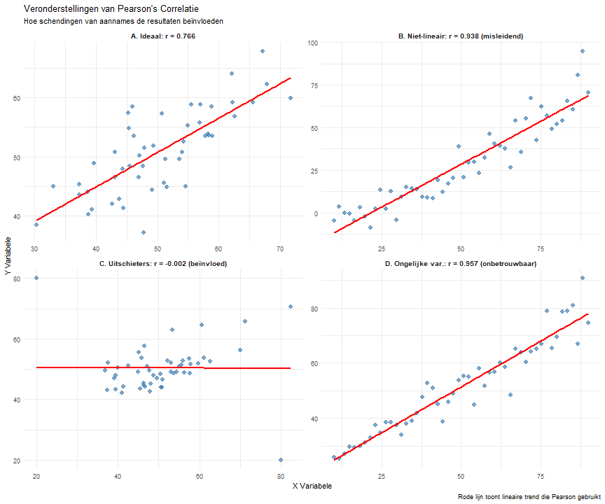<table class="table table-striped table-hover" style="margin-left: auto; margin-right: auto;">
<caption>Overzicht van Pearson Correlatie Veronderstellingen</caption>
 <thead>
  <tr>
   <th style="text-align:left;"> Veronderstelling </th>
   <th style="text-align:left;"> Betekenis </th>
   <th style="text-align:left;"> Wat Controleren </th>
   <th style="text-align:left;"> Bij Schending Gebruik </th>
  </tr>
 </thead>
<tbody>
  <tr>
   <td style="text-align:left;width: 2cm; font-weight: bold;"> 1. Lineaire Relatie </td>
   <td style="text-align:left;width: 3cm; "> De relatie tussen variabelen moet rechtlijnig zijn </td>
   <td style="text-align:left;width: 3cm; "> Spreidingsdiagram - punten volgen rechte lijn </td>
   <td style="text-align:left;width: 3cm; "> Spearman correlatie of data transformatie </td>
  </tr>
  <tr>
   <td style="text-align:left;width: 2cm; font-weight: bold;"> 2. Continue Variabelen </td>
   <td style="text-align:left;width: 3cm; "> Beide variabelen moeten interval of ratio meetnivaeu hebben </td>
   <td style="text-align:left;width: 3cm; "> Meetschaal - zijn het getallen met betekenisvolle afstanden? </td>
   <td style="text-align:left;width: 3cm; "> Spearman correlatie voor ordinale data </td>
  </tr>
  <tr>
   <td style="text-align:left;width: 2cm; font-weight: bold;"> 3. Normale Verdeling </td>
   <td style="text-align:left;width: 3cm; "> Data benadert normale verdeling (klokromige curve) </td>
   <td style="text-align:left;width: 3cm; "> Histogrammen/Q-Q plots van beide variabelen </td>
   <td style="text-align:left;width: 3cm; "> Spearman correlatie (robuuster) </td>
  </tr>
  <tr>
   <td style="text-align:left;width: 2cm; font-weight: bold;"> 4. Geen Extreme Uitschieters </td>
   <td style="text-align:left;width: 3cm; "> Geen extreme waarden die de correlatie vertekenen </td>
   <td style="text-align:left;width: 3cm; "> Spreidingsdiagram - zoek naar punten ver van de lijn </td>
   <td style="text-align:left;width: 3cm; "> Verwijder uitschieters of gebruik Spearman </td>
  </tr>
  <tr>
   <td style="text-align:left;width: 2cm; font-weight: bold;"> 5. Homoscedasticiteit </td>
   <td style="text-align:left;width: 3cm; "> Variantie rond de lijn blijft constant voor alle X-waarden </td>
   <td style="text-align:left;width: 3cm; "> Residual plots - variantie moet constant blijven </td>
   <td style="text-align:left;width: 3cm; "> Data transformatie of robuuste methoden </td>
  </tr>
</tbody>
</table>

**Kernconcepten:**
- **Lineariteit**: Relatie moet rechtlijnig zijn (niet gebogen)
- **Continue data**: Interval/ratio meetschaal vereist
- **Normaliteit**: Data benadert normale verdeling
- **Geen uitschieters**: Extreme waarden kunnen correlatie vertekenen
- **Homoscedasticiteit**: Gelijke variantie over alle waarden

> **Hint:** Denk aan wat Pearson correlatie meet (lineaire relaties) en welke data daarvoor geschikt is.

1) Alleen lineaire relatie en continue variabelen zijn vereist  
"1" = " ❌ Onjuist. Hoewel lineariteit en continue variabelen inderdaad belangrijke veronderstellingen zijn, zijn er meer aannames die gecontroleerd moeten worden. Normaliteit is belangrijk voor de interpretatie van statistische significantie en betrouwbaarheidsintervallen. Extreme uitschieters kunnen Pearson correlatie drastisch beïnvloeden omdat het gebaseerd is op werkelijke waarden (niet rangnummers zoals Spearman). Homoscedasticiteit (gelijke variantie) beïnvloedt de betrouwbaarheid van correlatieschattingen. In criminologisch onderzoek kan het negeren van deze aannames leiden tot verkeerde conclusies - bijvoorbeeld, uitschieters in geweldsdata kunnen de correlatie tussen sociaaleconomische factoren en criminaliteit vertekenen. Een grondige controle van alle veronderstellingen zorgt voor betrouwbare resultaten."

2) Lineariteit, continue variabelen, normale verdeling, geen extreme uitschieters, en gelijke variantie  
"2" = " ✅ Juist! Deze vijf veronderstellingen zijn essentieel voor valide Pearson correlatie interpretatie. Lineariteit is fundamenteel omdat Pearson alleen lineaire relaties meet - gebogen relaties kunnen misleidende correlaties opleveren. Continue variabelen zijn vereist omdat Pearson werkt met werkelijke waarden en afstanden tussen waarden. Normale verdeling is belangrijk voor statistische inferentie (p-waarden, betrouwbaarheidsintervallen). Extreme uitschieters kunnen correlaties dramatisch beïnvloeden omdat Pearson gevoelig is voor extreme waarden. Homoscedasticiteit (gelijke variantie) zorgt voor stabiele correlatieschattingen. Zoals getoond in de visualisatie, leiden schendingen van deze aannames tot misleidende of onbetrouwbare correlaties. In criminologisch onderzoek helpt het controleren van deze veronderstellingen onderzoekers te bepalen of Pearson geschikt is of dat alternatieve methoden (zoals Spearman) beter zijn."

3) Alleen dat beide variabelen normaal verdeeld zijn  
"3" = " ❌ Onjuist. Normale verdeling is belangrijk maar niet de enige vereiste. Zelfs als beide variabelen perfect normaal verdeeld zijn, kan Pearson correlatie nog steeds misleidend zijn als andere veronderstellingen geschonden worden. Bijvoorbeeld, twee normaal verdeelde variabelen kunnen een niet-lineaire relatie hebben (zoals een U-vormige curve) die Pearson correlatie zal onderschatten. Of er kunnen extreme uitschieters zijn die, hoewel technisch onderdeel van een normale verdeling, onevenredige invloed hebben op de correlatie. In criminologisch onderzoek zijn variabelen zoals inkomen of criminaliteitscijfers vaak scheef verdeeld, maar zelfs wanneer ze genormaliseerd worden door transformaties, moeten nog steeds andere aannames zoals lineariteit en afwezigheid van invloedrijke punten gecontroleerd worden."

4) Dat er minstens 30 observaties zijn en alle waarden positief zijn  
"4" = " ❌ Onjuist. Deze zijn geen statistische veronderstellingen van Pearson correlatie. Hoewel grotere steekproeven (N ≥ 30) statistisch wenselijk zijn voor betrouwbaardere schattingen, is dit geen formele veronderstelling van de correlatiemethode zelf. Pearson correlatie kan berekend worden met kleinere steekproeven, hoewel de resultaten minder stabiel zijn. Positieve waarden zijn ook niet vereist - correlatie werkt perfect met negatieve waarden, gemengde positieve/negatieve waarden, of zelfs gecentreerde data (met gemiddelde nul). In criminologisch onderzoek hebben variabelen vaak negatieve waarden (bijvoorbeeld, gecentreerde scores, temperatuurafwijkingen, of veranderingsscores). De werkelijke veronderstellingen gaan over de vorm van relaties en dataverdelingen, niet over arbitraire numerieke eigenschappen zoals positiviteit."

---
1) Accepteer r = -0,43 als nauwkeurig omdat het statistisch significant is  
"1" = " ❌ Onjuist. Uitschieters kunnen Pearson correlatie dramatisch beïnvloeden, en statistische significantie betekent niet dat de methode geschikt is. Pearson's correlatiecoëfficiënt (r) veronderstelt een lineaire relatie en normale verdeling van variabelen, waardoor het zeer gevoelig is voor extreme waarden (niet robuust). In dit geval trekken de drie uitschieters die zichtbaar zijn in het spreidingsdiagram (de oranje driehoeken) waarschijnlijk de correlatiecoëfficiënt naar nul van wat een sterkere negatieve relatie zou zijn. Statistische significantie vertelt ons alleen dat de relatie onwaarschijnlijk te wijten is aan toeval; het valideert niet de keuze van correlatiemethode. In criminologisch onderzoek kunnen uitschieters belangrijke speciale gevallen vertegenwoordigen, maar hun onevenredige wiskundige impact op Pearson's r kan het algemene patroon verdoezelen."

2) Bevraagteken de robuustheid van de correlatie; adviseer rapportage van zowel Pearson als Spearman correlaties  
"2" = " ✅ Juist! Uitschieters kunnen Pearson r vervormen; Spearman correlatie zou robuuster zijn voor extreme waarden. Door data om te zetten naar rangen vermindert Spearman's correlatie (ρ of rho) de invloed van uitschieters en biedt een nauwkeurigere maat van de monotone relatie tussen onderwijs en arrestatiecijfers. In dit geval onthult Spearman's correlatie (-0,67) een sterkere negatieve relatie dan Pearson's (-0,43), wat suggereert dat onderwijs' beschermende effect tegen arrestaties wordt onderschat door de niet-robuuste Pearson coëfficiënt. Het rapporteren van beide metrieken wordt beschouwd als beste praktijk in criminologisch onderzoek wanneer data uitschieters bevatten. Deze robuuste benadering biedt transparantie en stelt lezers in staat te begrijpen hoe gevoelig de bevindingen zijn voor analytische keuzes en extreme waarden."

3) Verwerp de gehele analyse omdat uitschieters alle correlationele studies ongeldig maken  
"3" = " ❌ Onjuist. Uitschieters maken analyse niet ongeldig maar vereisen robuuste behandeling. Hoewel uitschieters niet-robuuste correlatiecoëfficiënten beïnvloeden, maken ze de gehele analyse niet waardeloos. In plaats daarvan signaleren ze de noodzaak voor robuuste statistische benaderingen. In de criminologie vertegenwoordigen uitschieters vaak betekenisvolle gevallen (bijv. individuen met unieke kenmerken) in plaats van meetfouten. Juiste robuuste benaderingen zijn: (1) robuuste correlatiemethoden gebruiken zoals Spearman's of Kendall's tau; (2) resultaten rapporteren zowel met als zonder uitschieters; (3) variabelen transformeren; of (4) robuuste regressietechnieken gebruiken. Volledige verwerping zou waardevolle data verspillen. Criminologen moeten uitschieters herkennen en geschikte robuuste analytische strategieën selecteren."

4) De correlatie is zeker te zwak om betekenisvol te zijn ongeacht uitschieters  
"4" = " ❌ Onjuist. r = -0,43 vertegenwoordigt een matige relatie die praktisch belangrijk zou kunnen zijn, en robuuste analyse toont een nog sterkere relatie. In criminologisch onderzoek kunnen zelfs matige correlaties substantiële implicaties hebben voor beleid. Een correlatie van -0,43 duidt erop dat ongeveer 18% van de variantie in arrestatiecijfers wordt verklaard door opleidingsniveau — een opmerkelijke bevinding. In de criminologie worden correlaties boven 0,3 vaak als betekenisvol beschouwd. Wanneer geanalyseerd met robuuste methoden die minder gevoelig zijn voor uitschieters (zoals de Spearman correlatie van -0,67), lijkt de relatie zelfs sterker. Het wegwuiven van matige correlaties als 'te zwak' riskeert het over het hoofd zien van belangrijke criminologische relaties die beleid kunnen informeren."

---

## CREËREN NIVEAU (2 vragen)

### Vraag Q24 (Creëren)
**Ontwerp een correlationele studie om de relatie tussen social media gebruik en antisociaal gedrag bij adolescenten te onderzoeken. Welke belangrijke ontwerpelementen zou je opnemen?**

> **Hint:** Overweeg variabelen, meting, steekproeftrekking, controles en ethische overwegingen.

1) Enquête bij 100 tieners over uren social media gebruik en zelf-gerapporteerde antisociale daden  
"1" = " ❌ Onvolledig. Dit ontwerp heeft verschillende methodologische zwakheden: (1) De steekproefgrootte (N=100) is relatief klein voor het detecteren van potentieel subtiele effecten in gedragsonderzoek; (2) Simpele zelf-gerapporteerde uren faalt om de complexe, multidimensionale aard van social media gebruik vast te leggen (verschillende platforms, actief vs. passief gebruik, inhoudstypen, etc.); (3) Geen controlevariabelen betekent dat elke waargenomen correlatie te wijten kan zijn aan talloze verstorende factoren (sociaaleconomische status, ouderlijk toezicht, persoonlijkheidskenmerken, etc.); (4) Cross-sectioneel ontwerp voorkomt het vaststellen van temporele voorrang, wat noodzakelijk is voor causale inferentie; (5) Geen validatiematen voor zelf-gerapporteerd antisociaal gedrag verhoogt meetfouten. Een robuuste correlationele studie vereist het aanpakken van deze methodologische uitdagingen."

2) Longitudinaal ontwerp dat social media gebruik meet (meerdere platforms, tijd), antisociaal gedrag (meerdere maten), controleert voor leeftijd, SES en familiefactoren, met juist ethisch toezicht  
"2" = " ✅ Juist! Dit uitgebreide ontwerp incorporeert belangrijke methodologische sterktes: (1) Longitudinale meting staat toe veranderingen over tijd te volgen en temporele voorrang vast te stellen (ging social media gebruik vooraf aan gedragsveranderingen?); (2) Het meten van meerdere aspecten van social media gebruik (tijd besteed, platformtypen, inhoudsbetrokkenheid) vangt de complexiteit van digitaal gedrag; (3) Het gebruiken van meerdere gedragsmaten versterkt constructvaliditeit en vermindert meetfouten; (4) Controleren voor belangrijke covariaten zoals leeftijd, sociaaleconomische status en familiefactoren helpt alternatieve verklaringen uit te sluiten; (5) Ethisch toezicht zorgt voor deelnemersbescherming, geïnformeerde toestemming, data privacy en gepaste risicomanagement. Dit ontwerp maximaliseert de validiteit van potentiële correlationele bevindingen terwijl het methodologische zwakheden minimaliseert."

3) Experimentele manipulatie waarbij sommige tieners worden toegewezen aan hoog social media gebruik  
"3" = " ❌ Ongepast. Hoewel experimentele ontwerpen causaliteit definitiever kunnen vaststellen dan correlationele ontwerpen, heeft deze benadering ernstige gebreken: (1) Ethische zorgen met potentieel schadelijke manipulatie — onderzoeksetische principes verbieden het blootstellen van deelnemers, vooral minderjarigen, aan interventies die risico kunnen verhogen voor negatieve uitkomsten; (2) Externe validiteitsproblemen, omdat kunstmatig toegewezen social media gebruik verschilt van natuurlijke, zelf-geselecteerde gebruikspatronen; (3) Ecologische validiteitsproblemen, omdat gecontroleerde experimentele condities de echte wereld social media betrokkenheid slecht vertegenwoordigen; (4) Retentie-uitdagingen bij het handhaven van compliantie met toegewezen condities over betekenisvolle tijdsperioden; (5) De vraag vroeg specifiek om een correlationeel ontwerp, niet een experimenteel. Experimentele ontwerpen hebben hun plaats, maar moeten ethisch en gepast worden geïmplementeerd."

4) Eenvoudige correlatie tussen totale schermtijd en politiecontacten  
"4" = " ❌ Te simplistisch. Deze benadering heeft meerdere conceptuele en methodologische zwakheden: (1) Totale schermtijd is een te algemene maat, die alles omvat van huiswerk tot videogames, niet specifiek social media gebruik; (2) Politiecontacten vertegenwoordigen alleen de meest extreme en gedetecteerde antisociale gedragingen, waardoor de overgrote meerderheid van minor en ongedetecteerde gedragingen wordt gemist; (3) Beide maten zijn zeer vatbaar voor selectiebias, meetfouten en derde-variabele problemen; (4) Geen overweging van belangrijke modererende factoren (leeftijd, geslacht, sociaaleconomische context) die beide variabelen beïnvloeden; (5) Mist meetvaliditeit voor zowel de onafhankelijke als afhankelijke variabelen. De resulterende correlatie zou moeilijk betekenisvol te interpreteren zijn vanwege deze fundamentele beperkingen."

---

### Vraag Q25 (Creëren)
**Formuleer een toetsbare onderzoekshypothese over de relatie tussen economische ongelijkheid en geweldsmisdaadcijfers op stadsniveau, inclusief voorspelde richting en sterkte.**

> **Hint:** Creëer een specifieke, directionele hypothese die getest kan worden met correlatie/regressie.

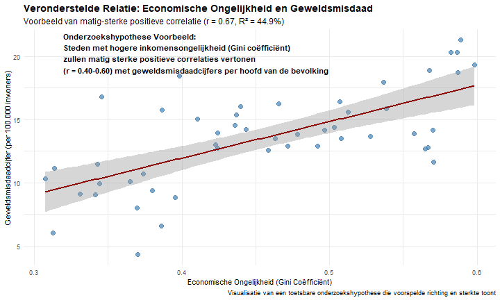

**Hypothese Formulatie Elementen:**
1. **Variabelen:** Specifiek gedefinieerd en meetbaar (Gini coëfficiënt, geweldsmisdaadcijfer per 100.000)
2. **Richting:** Duidelijke voorspelling (positieve correlatie)
3. **Magnitude:** Verwacht effectgroottebereik (r = 0.40-0.60)
4. **Analyse-eenheid:** Gespecificeerd niveau (stadsniveau)
5. **Testbaarheid:** Kan worden bevestigd/afgewezen met statistische analyse

1) "Economische ongelijkheid beïnvloedt misdaad op de een of andere manier"  
"1" = " ❌ Te vaag. Deze stelling faalt als toetsbare hypothese om verschillende redenen: (1) Het mist directionaliteit — specificeert niet of ongelijkheid misdaad verhoogt of verlaagt; (2) Geen operationalisatie van sleutelvariabelen — hoe wordt economische ongelijkheid gemeten? Welk type misdaad?; (3) Geen analyse-eenheid — op welk niveau (individueel, buurt, stad, land) wordt deze relatie onderzocht?; (4) Geen voorspelde effectgrootte of relatiesterkte; (5) Geen temporele scope gespecificeerd. Een goede onderzoekshypothese heeft precisie nodig in al deze dimensies. Zonder dergelijke specificiteit blijft de claim een algemene uitspraak die niet betekenisvol getest kan worden met correlatie- of regressieanalyse, omdat het onmogelijk is te bepalen wat bewijs voor of tegen zou constitueren."

2) "Steden met hogere inkomensongelijkheid (Gini coëfficiënt) zullen matig sterke positieve correlaties vertonen (r = 0.40-0.60) met geweldsmisdaadcijfers per hoofd van de bevolking"  
"2" = " ✅ Juist! Deze hypothese illustreert alle sleutelelementen van een goed geformuleerde, toetsbare onderzoeksvoorspelling: (1) Duidelijke specificatie van variabelen — inkomensongelijkheid gemeten door de Gini coëfficiënt en geweldsmisdaadcijfers per hoofd van de bevolking; (2) Expliciete directionaliteit — een positieve correlatie wordt voorspeld; (3) Gedefinieerde magnitude — matig sterke correlatie in het bereik van r = 0.40-0.60; (4) Gepaste analyse-eenheid — stadsniveau vergelijking; (5) Geïmpliceerd onderzoeksontwerp — correlationele analyse over meerdere steden. Deze precieze formulering staat duidelijke testing toe met statistische methoden, met specifieke criteria voor bevestiging of verwerping. De inclusie van een verwacht effectgroottebereik demonstreert verfijnd begrip van zowel de statistische methoden als het substantiële onderzoeksgebied, wat betekenisvolle interpretatie van resultaten mogelijk maakt ongeacht het studieveld."

3) "Arme mensen plegen meer geweldsmisdrijven"  
"3" = " ❌ Individueel-niveau claim, ongepast om verschillende redenen: (1) Deze stelling maakt een causale claim over individueel gedrag in plaats van een correlatie op stadsniveau zoals gevraagd; (2) Het conflateert economische status met ongelijkheid — armoede en ongelijkheid zijn gerelateerde maar verschillende concepten; (3) Het impliceert een directe causale relatie in plaats van een correlatie; (4) De analyse-eenheid (individuen) komt niet overeen met wat werd gevraagd (stadsniveau); (5) Geen metingsoperationalisatie is verstrekt — hoe wordt armoede gedefinieerd? Hoe wordt misdaad gemeten? De fundamentele mismatch tussen deze individueel-niveau causale claim en de gevraagde stadsniveau correlatiehypothese maakt dit antwoord onjuist, ongeacht of de onderliggende claim mogelijk ondersteund wordt door andere onderzoeksbenaderingen."

4) "Economische ongelijkheid is de enige oorzaak van alle geweldsmisdaad"  
"4" = " ❌ Te extreem en ontoetsbaar. Deze stelling faalt als hypothese omdat: (1) Het maakt een absolute causale claim — identificeert ongelijkheid als de 'enige oorzaak' — in plaats van een correlatie voor te stellen; (2) Het gebruikt universele taal ('alle geweldsmisdaad') die zou worden ontkracht door een enkel tegenvoorbeeld; (3) Het mist elke specificatie van meting voor beide variabelen; (4) Het stelt een perfecte relatie voor die de complexiteit van menselijk gedrag tegenspreekt; (5) Het kan niet betekenisvol getest worden met correlatie- of regressieanalyse, omdat correlatiecoëfficiënten van nature geen enkele causaliteit kunnen vaststellen. In elk wetenschappelijk veld worden hypotheses die absolute claims maken over enkele causaliteit over het algemeen als te extreem beschouwd en falen ze de multivariate aard van complexe fenomenen te erkennen."

---
